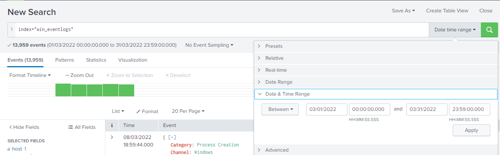
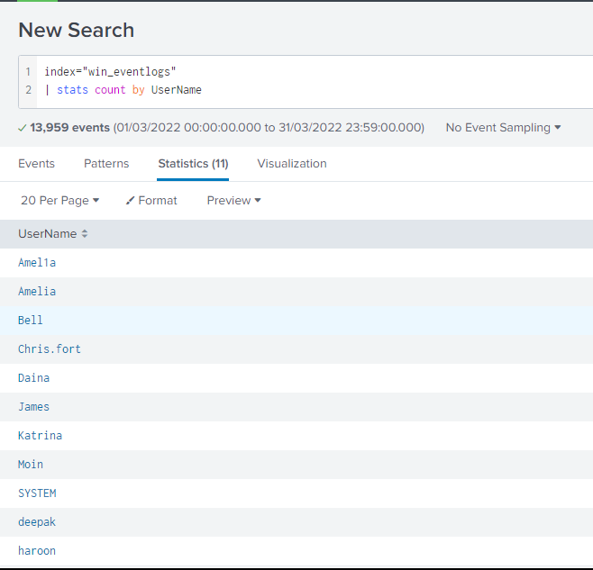
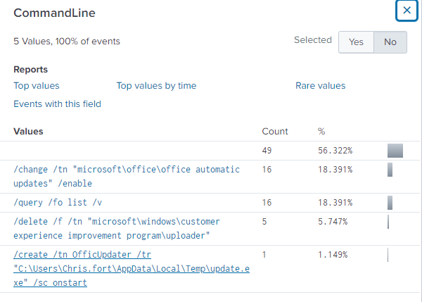
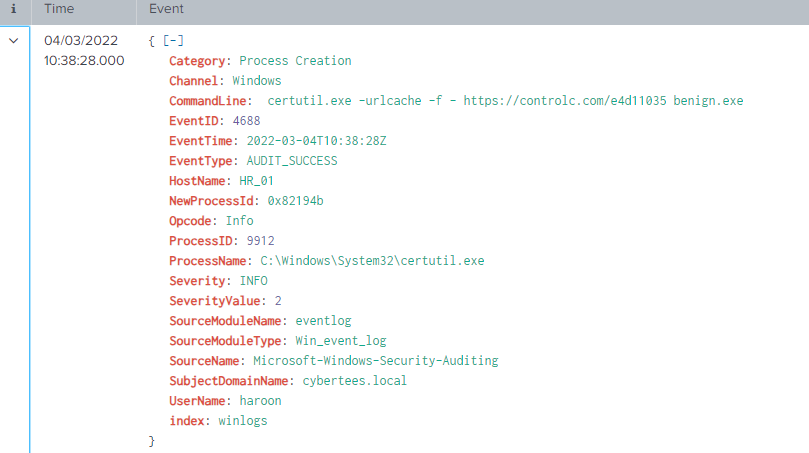
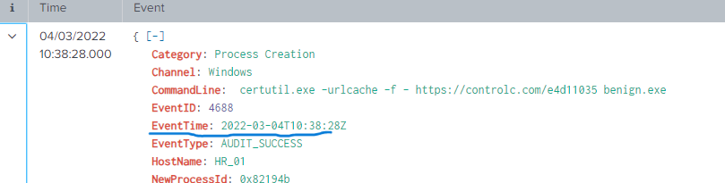
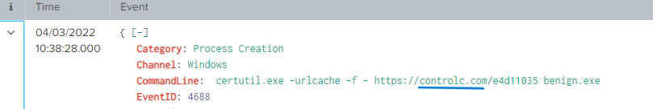
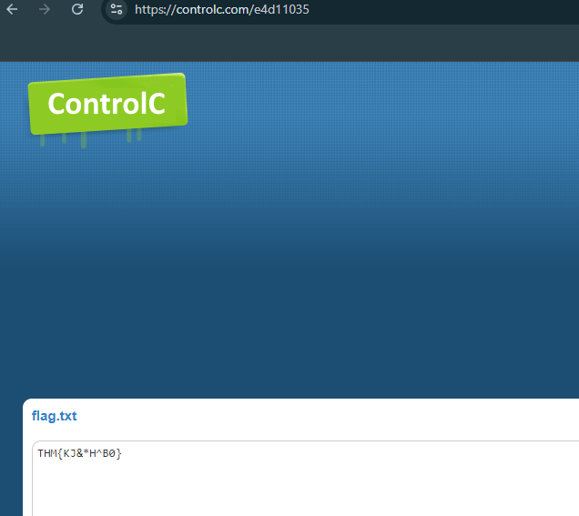

# Benign Writeup

## Task 2: Scenario - Identify and Investigate an Infected Host

One of the client’s IDS indicated a potentially suspicious process execution, suggesting that one of the hosts from the HR department was compromised. Tools related to network information gathering and scheduled tasks were executed, confirming the suspicion. Due to limited resources, we could only pull the process execution logs with **Event ID: 4688** and ingested them into Splunk, under the index `win_eventlogs`, for further investigation.

### About the Network Information

The network is divided into three logical segments, which will assist in the investigation:

- **IT Department:**
  - James
  - Moin
  - Katrina
  
- **HR Department:**
  - Haroon
  - Chris
  - Diana

- **Marketing Department:**
  - Bell
  - Amelia
  - Deepak

### Answer the questions below:

#### 1.1 How many logs are ingested from the month of March 2022?
To determine this, I searched for the index `win_eventlogs` and filtered the time range to March 2022.



**Answer:** 13959

#### 1.2 Imposter Alert: There seems to be an imposter account observed in the logs. What is the name of that user?
I checked the `UserName` field. There were 11 values in total, but Splunk only showed the top 10. I used the `stats` command to display all 11 values.

```
stats count by UserName
```

This revealed the imposter account.



**Answer:** Amel1a

#### 1.3 Which user from the HR department was observed running scheduled tasks?
I used the following query to search for the process name `schtasks`: 

```
index="win_eventlogs" | search ProcessName = "*schtasks*"
```
I then checked the `Process_Command_Line` and found one user running a scheduled task.



**Answer:** Chris.fort

#### 1.4 Which user from the HR department executed a system process (LOLBIN) to download a payload from a file-sharing host?
I narrowed the search to hosts in the HR department and identified processes commonly used as LOLBins (e.g., `powershell.exe`, `certutil.exe`, `bitsadmin.exe`). After searching for `certutil.exe`, I found the relevant event.

```
index = "win_eventlogs" HostName=HR_01 OR HR_02 OR HR_03 | search ProcessName="certutil.exe"
```


Expanding the event revealed the username.



**Answer:** haroon

#### 1.5 To bypass the security controls, which system process (LOLBIN) was used to download a payload from the internet?
This was found in the previous search.

**Answer:** certutil.exe

#### 1.6 What was the date that this binary was executed by the infected host? (format: YYYY-MM-DD)
The answer can be found in the event screenshot provided in question 1.4.



**Answer:** 2022-03-04

#### 1.7 Which third-party site was accessed to download the malicious payload?
This information is also from the event referenced in question 1.4. I checked the `CommandLine` to find the third-party site.



**Answer:** controlc.com

#### 1.8 What is the name of the file that was saved on the host machine from the C2 server during the post-exploitation phase?
The `CommandLine` shows the filename.

**Answer:** benign.exe

#### 1.9 The suspicious file downloaded from the C2 server contained malicious content with the pattern THM{..........}. What is that pattern?
I visited the site referenced in the command line to retrieve the content.



**Answer:** THM{KJ&*H^B0}

#### 1.10 What is the URL that the infected host connected to?
This was found in the same event as question 1.4 and is the site visited to retrieve the content from question 1.9.

**Answer:** https://controlc.com/e4d11035

---

This concludes the investigation. Toodles!
