# Boogeyman 1
A new threat actor emerges from the wild using the name Boogeyman. Are you afraid of the Boogeyman?

## TASK 1: [Introduction] New threat in town.
Uncover the secrets of the new emerging threat, the Boogeyman.

In this room, you will be tasked to analyse the Tactics, Techniques, and Procedures (TTPs) executed by a threat group, from obtaining initial access until achieving its objective. 

## TASK 2: [Email Analysis] Look at that headers!

The Boogeyman is here!

Julianne, a finance employee working for Quick Logistics LLC, received a follow-up email regarding an unpaid invoice from their business partner, B Packaging Inc. Unbeknownst to her, the attached document was malicious and compromised her workstation.

The security team was able to flag the suspicious execution of the attachment, in addition to the phishing reports received from the other finance department employees, making it seem to be a targeted attack on the finance team. Upon checking the latest trends, the initial TTP used for the malicious attachment is attributed to the new threat group named Boogeyman, known for targeting the logistics sector.

You are tasked to analyse and assess the impact of the compromise.

### Answer the questions below

> **2.1 What is the email address used to send the phishing email?**
>
I opened the mail with Thunderbird and copied the email address

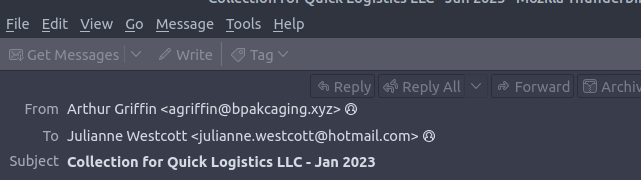

**ANS:agriffin@bpakcaging.xyz**

> **2.2 What is the email address of the victim?**
>
Also, same process as above. The email is in the screenshot

**ANS: julianne.westcott@hotmail.com**

> **2.3 What is the name of the third-party mail relay service used by the attacker based on the DKIM-Signature and List-Unsubscribe headers?**
>
I made use of the terminal to read the dump.eml file and grep for DKIM

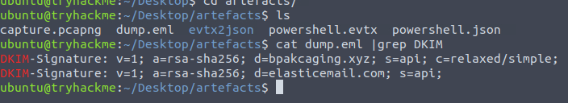

**ANS: elasticemail**

> **2.4 What is the name of the file inside the encrypted attachment?**
>
I read the file with cat command, then I saw a base64 string. THM already gave us tips on how to go about this. So I copied the base64 string and used echo to rebuild the payload. 

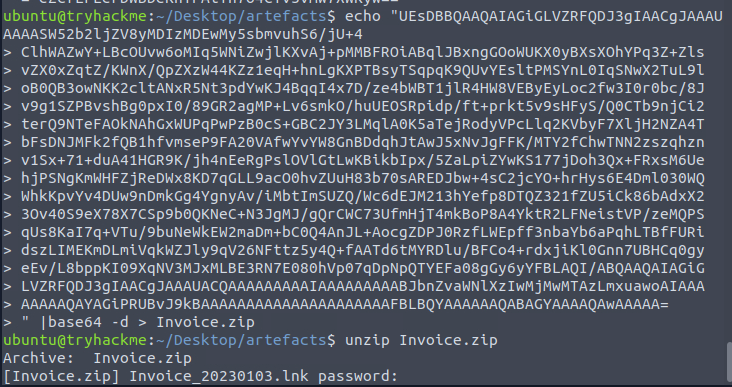

The password was given already

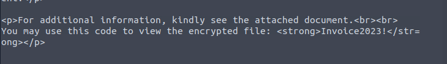

**ANS: Invoice_20230103.lnk**

> **2.5 What is the password of the encrypted attachment?**
>
**ANS: Invoice2023!**

> **2.6 Based on the result of the lnkparse tool, what is the encoded payload found in the Command Line Arguments field?**
>
I used the command “ lnkparse Invoice_20230103.lnk” then in the result, I scrolled up a little then found the command

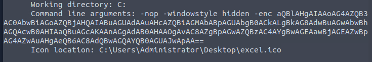

---
## TASK 3: [Endpoint Security] Are you sure that’s an invoice?

Based on the initial findings, we discovered how the malicious attachment compromised Julianne's workstation:

A PowerShell command was executed.
Decoding the payload reveals the starting point of endpoint activities. 

### Answer the questions below

>**3.1 What are the domains used by the attacker for file hosting and C2? Provide the domains in alphabetical order. (e.g. a.domain.com,b.domain.com)**
>
I started by parsing the JSON into a beautified output so I will know what field to search for. I went with the ScriptBlockText and used this command ; `cat powershell.json | jq .ScriptBlockText`
Scrolled up to check the result to find what I was looking for.

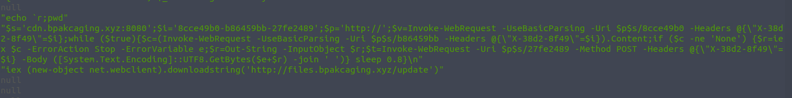

**ANS: cdn.bpakcaging.xyz,files.bpakcaging.xyz**

>**3.2 What is the name of the enumeration tool downloaded by the attacker?**
>
I searched through the same output and found a download link with the tool name.


**ANS: seatbelt**

>**3.3 What is the file accessed by the attacker using the downloaded sq3.exe binary? Provide the full file path with escaped backslashes.**
>
Checked the same output and saw the binary executed and the full path. 

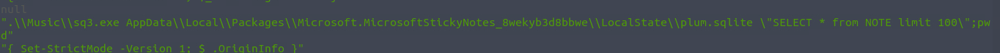

Then to get the full path, I checked the cd commands


**ANS: C:\\Users\\j.westcott\\AppData\\Local\\Packages\\Microsoft.MicrosoftStickyNotes_8wekyb3d8bbwe\\LocalState\\plum.sqlite**

>**3.4 What is the software that uses the file in Q3?**
>
I got this from the full path above.

**ANS: Microsoft Sticky Notes**

>**3.5 What is the name of the exfiltrated file?**
>
I found this in the same output, it is in the second image in Q3.3 above.

**ANS: protected_data.kdbx**

>**3.6 What type of file uses the .kdbx file extension?
>
**ANS: keepass**

>**3.7 What is the encoding used during the exfiltration attempt of the sensitive file?**
>
Still on the same output, looked for anything that looks like encoding and I found it

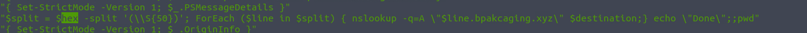

**ANS: hex**

>**3.8 What is the tool used for exfiltration?**
>
Check the screenshot above in 3.7

**ANS: nslookup**

---
## TASK 4: [Network Traffic Analysis] They got us. Call the bank immediately!

Based on the PowerShell logs investigation, we have seen the full impact of the attack:

The threat actor was able to read and exfiltrate two potentially sensitive files.
The domains and ports used for the network activity were discovered, including the tool used by the threat actor for exfiltration.

### Answer the questions below

>**4.1 What software is used by the attacker to host its presumed file/payload server?**
>
I just guessed python and I was right, lol

But then as a security analyst, I decided to do it the right way. Since I already have the malicious domains, I filtered the display for http packets that contained files.bpakcaging.xyz. 

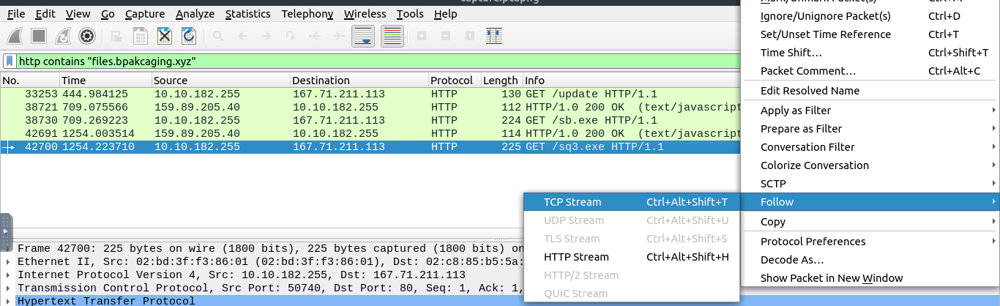
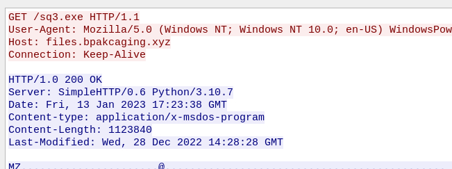

**ANS: python**

>**4.2 What HTTP method is used by the C2 for the output of the commands executed by the attacker?**
>
Since, we know the attacker is exfiltrating the data out and not requesting it in, the method would be POST

**ANS: POST**

>**4.3 What is the protocol used during the exfiltration activity?**
>
In task 3, question 8 the tool the attacker used was nslookup so the protocol is DNS

**ANS: DNS**

>**4.4 What is the password of the exfiltrated file?**
>
I made use of the hint THM gave me. I filtered the wireshark packets to search for http that contains sq3.exe 

I got 4 results, then I followed the TCP stream of each of them until I got to the last one then I found the same command that was found in the powershell log. 


I decided to follow the subsequent stream and I saw an output that I didn't understand. 

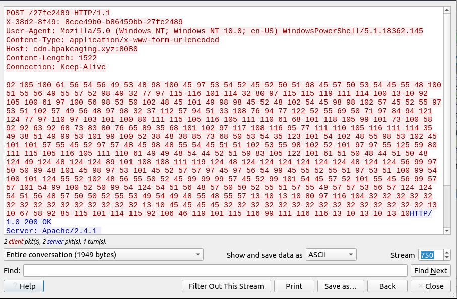

Then I took it to cyberchef and used the magic function and yes cyberchef can decode it from decimal so I applied the from decimal function and I found the master password!!

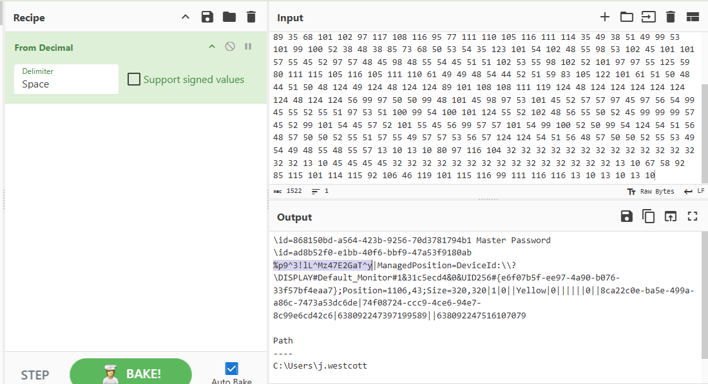

**ANS: %p9^3!lL^Mz47E2GaT^y**

>**4.5 What is the credit card number stored inside the exfiltrated file?**
>
From previous investigations, I already knew that the file was extracted through DNS. The attacker uses bpackcaging.xyz, so I filtered for DNS queries containing this domain.
```
tshark -r capture.pcapng  -Y 'dns' -T fields -e dns.qry.name |grep ".bpakcaging.xyz"
```

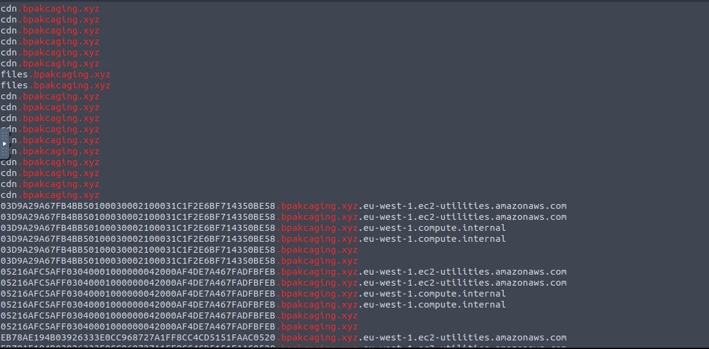

There are duplicates and unnecessary results so I had to clean the data 
```
tshark -r capture.pcapng  -Y 'dns' -T fields -e dns.qry.name |grep ".bpakcaging.xyz" | cut -f1 -d '.'|grep -v -e "files" -e "cdn" | uniq
```

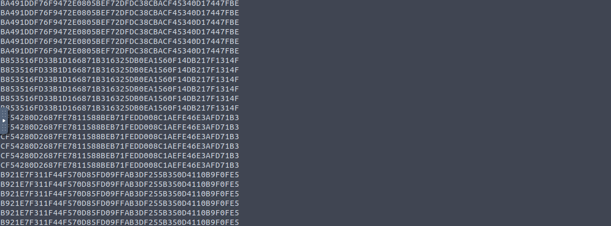

I had to remove empty spaces or newlines, so I used “tr” to make the output in one line of text. I also saved it to a text file.
```
tshark -r capture.pcapng  -Y 'dns' -T fields -e dns.qry.name |grep ".bpakcaging.xyz" | cut -f1 -d '.'|grep -v -e "files" -e "cdn" | uniq | tr -d '\\n' > data.txt 
```

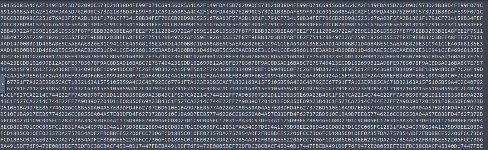

Then I converted the hex data into ASCII and saved it 
```
xxd -r -p data.txt > extracted.kdbx
```
Then I went ahead to open the kdbx file. It required the master password I got in the previous task 

Then I was able to copy the account number

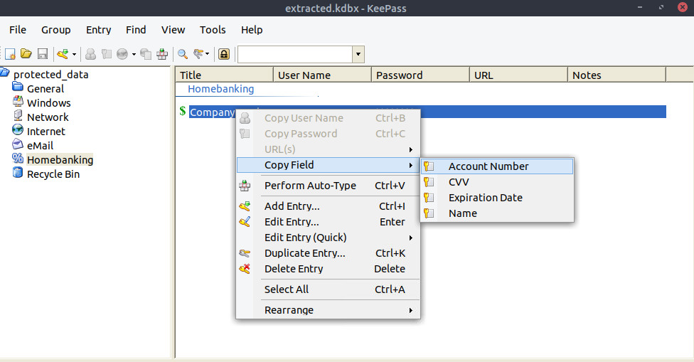

---
## Conclusion

Omoooo x10000
This last question took a lot of trial and error. I used chatgpt in troubleshooting. It kept saying data was corrupted whenever I tried to open the file.

Anyways, mission accomplished  I learned how the Boogeyman infected the victim’s device with a malicious attachment, collected and exfiltrated data with PowerShell and DNS, and stole credit card data stored in KeePass. 


