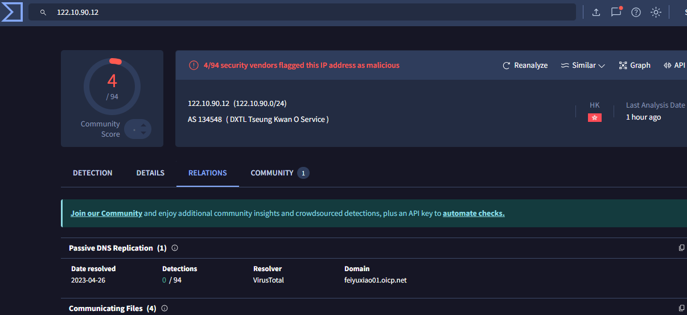
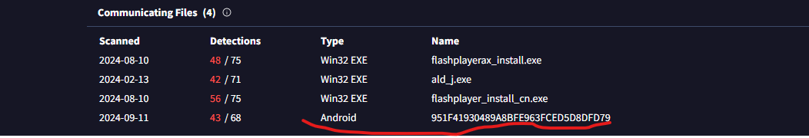

# Friday Overtime Writeup!!

 

## Scenario 
It's a Friday evening at PandaProbe Intelligence when a notification appears on your CTI platform. While most are already looking forward to the weekend, you realise you must pull overtime because SwiftSpend Finance has opened a new ticket, raising concerns about potential malware threats. The finance company, known for its meticulous security measures, stumbled upon something suspicious and wanted immediate expert analysis.

As the only remaining CTI Analyst on shift at PandaProbe Intelligence, you quickly took charge of the situation, realising the gravity of a potential breach at a financial institution. The ticket contained multiple file attachments, presumed to be malware samples.

With a deep breath, a focused mind, and the longing desire to go home, you began the process of:

Downloading the malware samples provided in the ticket, ensuring they were contained in a secure environment.
Running the samples through preliminary automated malware analysis tools to get a quick overview.
Deep diving into a manual analysis, understanding the malware's behaviour, and identifying its communication patterns.
Correlating findings with global threat intelligence databases to identify known signatures or behaviours.
Compiling a comprehensive report with mitigation and recovery steps, ensuring SwiftSpend Finance could swiftly address potential threats.

## TASK 1 - Who shared the malware samples?

Login to your pandaprobe intelligence account to read the ticket containing the information of the potential malware.

At the end of the ticket, you will see who shared the samples.

ANS: Oliver Bennett

## TASK 2 - What is the SHA1 hash of the file “pRsm.dll” inside samples.zip?

Download the actual attachment "samples.zip" and extract the files from it. 

We wiil use the terminal to extract the files and check the hash of "pRsm.dll". Then make use of shasum1 to check for the SHA1 hash of the file.

ANS: 9d1ecbbe8637fed0d89fca1af35ea821277ad2e8

## TASK 3 - Which malware framework utilizes these DLLs as add-on modules?

I checked Google to find information on "pRsm.dll" and the framework used. Then boom!, I found this site: 

I made use of Ctrl + F to search for "framework" and lucky for me, I found it.

ANS: MgBot

## TASK 4 - Which MITRE ATT&CK Technique is linked to using pRsm.dll in this malware framework?

Under the same site, I used Ctrl + F to search for "pRsm.dll" and then I found the Mitre Att&ck Technique

ANS: T1123

## TASK 5 - What is the CyberChef defanged URL of the malicious download location first seen on 2020-11-02?
Now we need to find a URL connected to 2020–11–02, and defang it on CyberChef. Well since the article I found on the site was detailed, I headed back to the site and searched for a URL connected to the date. Guess what? I found it there

Copy the URL and paste it on Cyberchef to get the defanged URL

ANS: hxxp[://]update[.]browser[.]qq[.]com/qmbs/QQ/QQUrlMgr_QQ88_4296[.]exe

## TASK 6 - What is the CyberChef defanged IP address of the C&C server first detected on 2020-09-14 using these modules?
I repeated the same process, I used Ctrl + F to search for the date and I found one connected to an IP address for C&C server.

Then I typed the ip address into cyberchef and defanged it.

ANS: 122[.]10[.]90[.]12

## TASK 7 - What is the SHA1 hash of the spyagent family spyware hosted on the same IP targeting Android devices on November 16, 2022?
Are you thinking we will just use the article again? No, we won't find the SHA1 hash there. Well, luckily for us we have virusTotal. We wiil Lookup the IP address on VirusTotal, below is the result:

Then we will go to the Relations Tab and see if we will find anything useful. Under the relations tab, I found an IOC (hash) on Android.

We can click on the hash found to see the details and boom it is the hash for the spyware. Then under the details tab is where the SHA1 hash is and that is it!

ANS: 1c1fe906e822012f6235fcc53f601d006d15d7be
