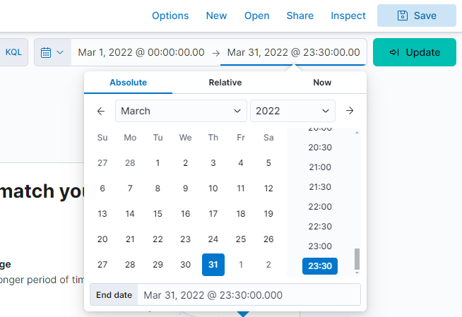
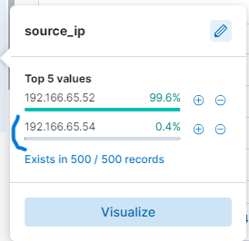
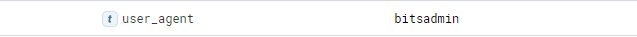
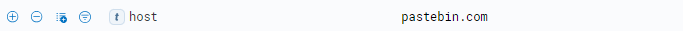
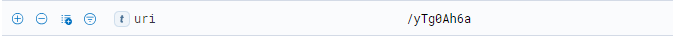
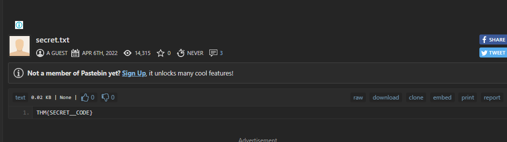

# ItsyBitsy Room Write-Up

## Scenario

During regular SOC monitoring, Analyst John observed an alert on an IDS solution indicating potential C2 communication from Browne, a user from the HR department. A suspicious file was accessed that contained a malicious pattern: `THM:{ ________ }`. To investigate, a week-long log of HTTP connections was pulled and ingested into the `connection_logs` index in Kibana. 

In this room, we’ll be examining these logs to uncover the connection details, identify the accessed file, and answer the related questions.

---

### Investigation Questions

#### 1. How many events were returned for the month of March 2022?

I navigated to the **Discover** tab in Kibana and filtered the date range from March 1, 00:00 to March 31, 23:30. The number of hits is shown below:

**Answer:** 1482

---

#### 2. What is the IP associated with the suspected user in the logs?

I selected **source_ip** from the field pane and found only two IP addresses. After trying both, I identified the correct one as:

**Answer:** 192.166.65.54

---

#### 3. The user’s machine used a legit Windows binary to download a file from the C2 server. What is the name of the binary?

Initially, I wasn’t sure what I was looking for, so I filtered the logs by the suspicious IP address. Only two hits appeared. Upon expanding one, I noticed **user_agent** was set to `bitsadmin`. After verifying that **bitsadmin** is indeed a Windows binary, I identified it as the tool used.

**Answer:** bitsadmin

---

#### 4. The infected machine connected with a famous file-sharing site, which also acts as a C2 server. What is the name of the file-sharing site?

Continuing with the filtered results, I found the **host** field, which referenced a well-known file-sharing site:

**Answer:** pastebin.com

---

#### 5. What is the full URL of the C2 to which the infected host is connected?

Still within the filtered results, I located the **uri** field. By combining the host and URI, I determined the full URL:

**Answer:** pastebin.com/yTg0Ah6a

---

#### 6. A file was accessed on the file-sharing site. What is the name of the file accessed?

After opening the full URL in my browser, I found the accessed file’s name:

**Answer:** secret.txt

---

#### 7. The file contains a secret code with the format THM{_____}.

Upon accessing the file, I found the hidden code:

**Answer:** THM{SECRET__CODE}

---

Thanks for reading!
