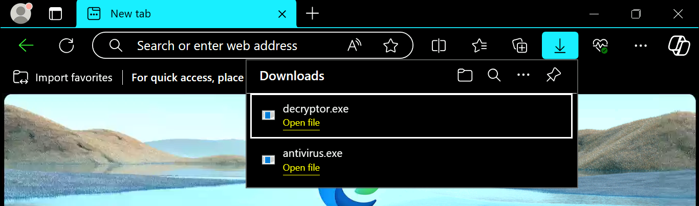

## TASK 1 - INTRODUCTION

### A Mother's Plea

> "Thanks for coming. I know you are busy with your new job, but I did not know who else to turn to.
> 
> So I downloaded and ran an installer for an antivirus program I needed. After a while, I noticed I could no longer open any of my files. Then I saw that my wallpaper was different, with a terrifying message telling me to pay if I wanted my files back. I panicked and got out of the room to call you. But when I came back, everything was back to normal.
> 
> Except for one message telling me to check my Bitcoin wallet. But I don't even know what Bitcoin is!
> 
> Can you help me check if my computer is now fine?"

## TASK 2 - The Message

> "As soon as you finish logging into the computer, you'll see a file on the desktop addressed to me. 
> 
> I have no idea why that message is there or what it means. Maybe you do?"

### Questions

**Q1. What is the full path of the text file containing the "message"?**

I opened File Explorer, went to the Desktop, clicked on the file, then went to Home in the menu bar, and selected Copy Path.

 

**ANS:** `C:\Users\Sophie\Desktop\SOPHIE.txt`

---

**Q2. What program was used to create the text file?**

Since it was a text file, I guessed and got it right.

**ANS:** `notepad.exe`

---

**Q3. What is the time of execution of the process that created the text file? Timezone UTC (Format YYYY-MM-DD hh:mm:ss)**

It was a process created by Notepad, so I opened Event Viewer, filtered the log with Event ID 1, then used the find button to search for `notepad.exe` and found it.

**ANS:** `2024-01-08 14:25:30`

---

## TASK 3 - Something Wrong

> "I swear something went wrong with my computer when I ran the installer. Suddenly, my files could not be opened, and the wallpaper changed, telling me to pay.
> 
> Wait, are you telling me that the file I downloaded is a virus? But I downloaded it from Google!"

### Questions

**Q4. What is the filename of this "installer"? (Including the file extension)**

Since the file was downloaded, I went to the Downloads folder. It was empty, but she said she downloaded it from Google, so I checked Microsoft Edge’s download history and found two files. The one she downloaded is the antivirus.

**ANS:** `antivirus.exe`

---

**Q5. What is the download location of this installer?**

In the browser, I opened the file location, then right-clicked on the file, checked the properties, and found the file path.

**ANS:** `C:\Users\Sophie\download`

---

**Q6. The installer encrypts files and then adds a file extension to the end of the file name. What is this file extension?**

I opened Event Viewer, scrolled through the events, and saw that file creation was marked with Event ID 11. I filtered the log with this ID and searched for the installer using find.

**ANS:** `.dmp`

---

**Q7. The installer reached out to an IP. What is this IP?**

The Event ID for network connections is 3, so I filtered the logs by this ID, searched for `antivirus.exe`, clicked on the event, and checked the destination IP address.

**ANS:** `10.10.8.111`

---

## TASK 4 - The Intrusion

> "So what happened to the virus? It does seem to be gone since all my files are back."

### Questions

**Q8. The threat actor logged in via RDP right after the “installer” was downloaded. What is the source IP?**

This is still a network connection, so I left the filter on Event ID 3, searched for `RDP`, clicked on details, and found the source IP. It took a few tries to get the right one.

**ANS:** `10.11.27.46`

---

**Q9. This other person downloaded a file and ran it. When was this file run? Timezone UTC (Format YYYY-MM-DD hh:mm:ss)**

I suspected the other downloaded file was the decryptor, so I went to Event Viewer, searched for `decryptor`, and checked the event for process creation.

**ANS:** `2024-01-08 14:24:18`

---

## TASK 5 - Doesn't Make Sense

> "So you're telling me that someone accessed my computer and changed my files but later undid the changes?
> 
> That doesn't make any sense. Why infect my machine and clean it afterwards?
> 
> Can you help me make sense of this?"

### Question

**Arrange the following events in sequential order from 1 to 7, based on the timeline in which they occurred:**

1. Sophie downloaded the malware and ran it.
2. The malware encrypted the files on the computer and showed a ransomware note.
3. Sophie ran out and reached out to you for help.
4. Someone else logged into Sophie’s machine via RDP and started looking around.
5. The intruder downloaded a decryptor and decrypted all the files.
6. A note was created on the desktop telling Sophie to check her Bitcoin.
7. We arrive on the scene to investigate.

---

## TASK 6 - CONCLUSION

> "Adelle from Finance just called me. She says that someone just donated a huge amount of bitcoin to our charity's account!
> 
> Could this be our intruder? His malware accidentally infected our systems, found the mistake, and retracted all the changes?
> 
> Maybe he had a change of heart?"

Yeah, possibly.

And that is all. Thank you for reading!
