# Secret Recipe Investigation

## Introduction - Storyline

Jasmine owns a famous New York coffee shop, *Coffely*, known city-wide for its unique coffee taste. Only Jasmine has access to the original recipe, which she stores exclusively on her work laptop. Recently, James from the IT department was asked to repair Jasmine's laptop, and it is suspected that he may have copied the secret recipes to his own machine.

James's machine has since been confiscated and examined, but no evidence was found initially. The security department has pulled important registry artifacts from his device, and you have been tasked with analyzing these artifacts to determine if the secret files are present on his machine.

---

## Task 2 - Windows Registry Forensics

### Registry Recap

The Windows Registry is a database containing valuable information about system settings, user activities, executed processes, accessed files, and more.

The following Registry Hives have been extracted from the suspect’s device and placed in the `C:\Users\Administrator\Desktop\Artifacts` folder:

- SYSTEM
- SECURITY
- SOFTWARE
- SAM
- NTUSER.DAT
- UsrClass.dat

All necessary tools are located at `C:\Users\Administrator\Desktop\EZ Tools`.

Your challenge is to examine these registry hives using the provided tools, observe the user's activities, and answer the following questions.

---

### Answers to Questions

> **2.1 What is the Computer Name of the Machine found in the registry?**

Using the Windows forensic cheat sheet, I located the computer name at `SYSTEM > Root > Controlset001 > Control > ComputerName`.

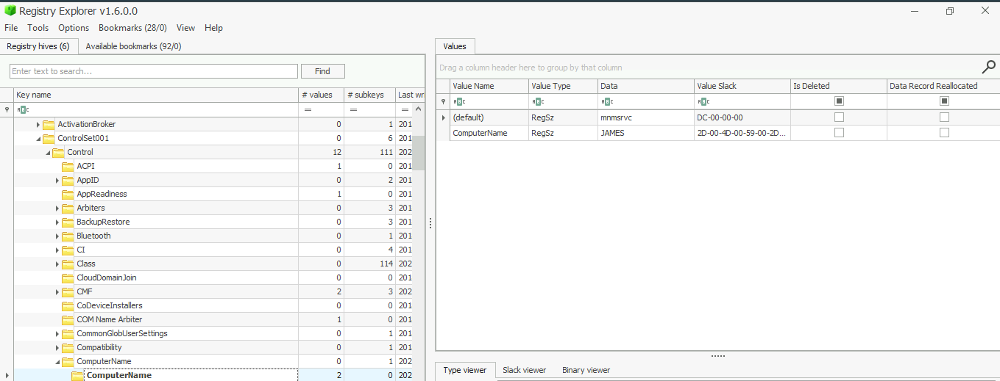

**Answer:** `JAMES`

> **2.2 When was the Administrator account created on this machine? (Format: yyyy-mm-dd hh:mm:ss)**

I found this information in the SAM Hive: `SAM > Root > SAM > Domains > Account > Users > Names > Administrator`. The last write timestamp is shown on the right.

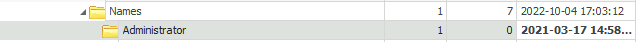

**Answer:** `2021-03-17 14:58:48`

> **2.3 What is the RID associated with the Administrator account?**

The RID (Relative Identifier) is part of a SID (Security Identifier) uniquely identifying users and groups. The Administrator RID is typically `500`, which I verified in the registry.

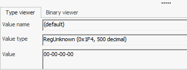

**Answer:** `500`

> **2.4 How many User accounts were observed on this machine?**

In the SAM Hive, I navigated to `ROOT > SAM > Domains > Account > Users` and counted the user accounts.

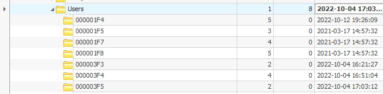

**Answer:** `7`

> **2.5 There seems to be a suspicious account created as a backdoor with RID 1013. What is the Account Name?**

In the `SAM > Root > SAM > Domains > Account > Users > Names` path, I found a suspicious account named `bdoor` with RID `1013`.

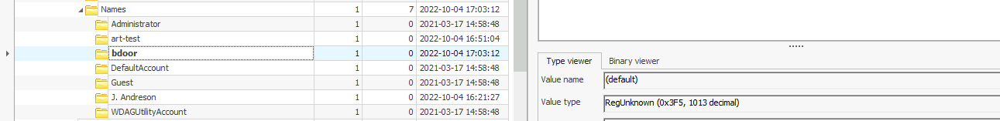

**Answer:** `bdoor`

> **2.6 What is the VPN connection this host connected to?**

I located the VPN details under the SOFTWARE Hive at `SOFTWARE > Microsoft > Windows NT > CurrentVersion > NetworkList`.

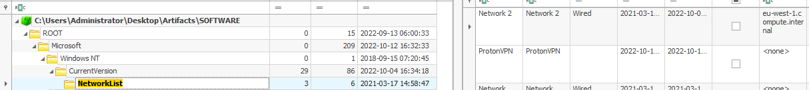

**Answer:** `ProtonVPN`

> **2.7 When was the first VPN connection observed? (Format: YYYY-MM-DD HH:MM:SS)**

On the same path (`SOFTWARE > Microsoft > Windows NT > CurrentVersion > NetworkList`), I found the "First Connect" timestamp.

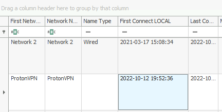

**Answer:** `2022-10-12 19:52:36`

> **2.8 There were three shared folders observed on his machine. What is the path of the third share?**

Under the SYSTEM Hive, I searched for `share`, finding the path `SYSTEM > CurrentControlSet > Services > LanmanServer > Shares`, where the third share was listed.

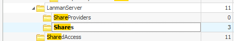
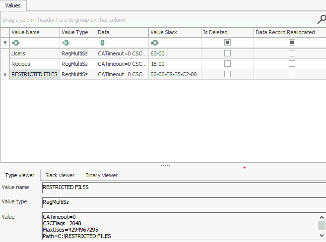

**Answer:** `C:\RESTRICTED FILES`

> **2.9 What is the Last DHCP IP assigned to this host?**

Using the Windows forensic cheat sheet, I found the network information under `SYSTEM\CurrentControlSet\Services\Tcpip\Parameters\Interfaces`.

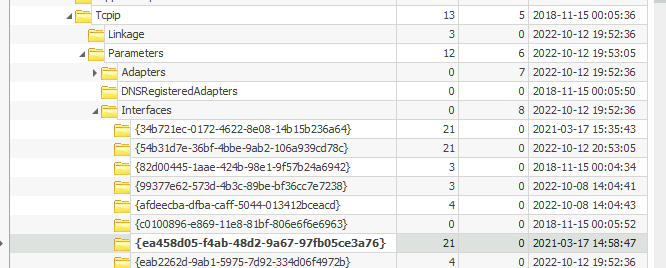
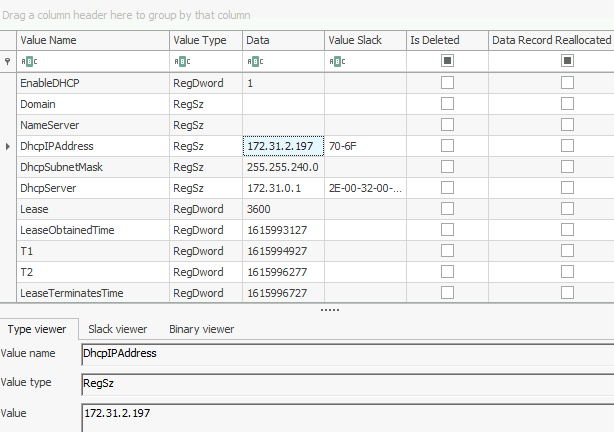

**Answer:** `172.31.2.197`

> **2.10 The suspect seems to have accessed a file containing the secret coffee recipe. What is the name of the file?**

In `NTUSER.DAT > Software > Microsoft > Windows > CurrentVersion > Explorer > RecentDocs`, I checked the `.pdf` file category and found the file.

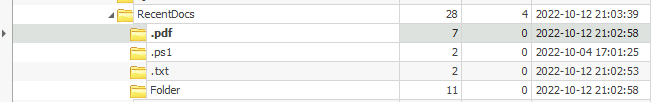
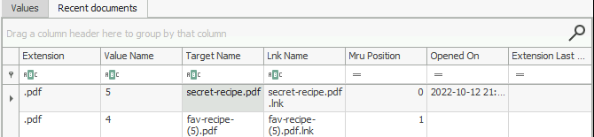

**Answer:** `secret-recipe.pdf`

> **2.11 The suspect ran multiple commands in the Run window. What command was run to enumerate the network interfaces?**

In `NTUSER.DAT > Software > Microsoft > Windows > CurrentVersion > Explorer > RunMRU`, I found the network enumeration command.

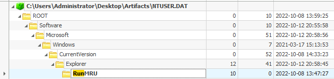
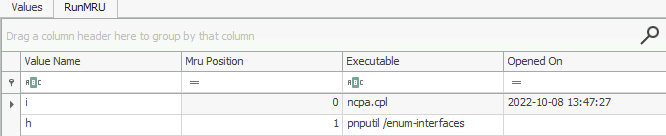

**Answer:** `pnputil /enum-interfaces`

> **2.12 In the File Explorer, the user searched for a network utility to transfer files. What is the name of that tool?**

Following the path `NTUSER.DAT > Software > Microsoft > Windows > CurrentVersion > Explorer > WordWheelQuery`, I identified the tool searched by the user.

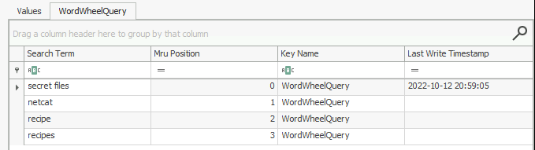

**Answer:** `netcat`

> **2.13 What is the recent text file opened by the suspect?**

In `NTUSER.DAT > Software > Microsoft > Windows > CurrentVersion > Explorer > RecentDocs`, I checked the `.txt` files.

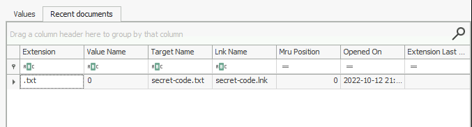

**Answer:** `secret-code.txt`

> **2.14 How many times was PowerShell executed on this host?**

Under `NTUSER.DAT\Software\Microsoft\Windows\CurrentVersion\Explorer\UserAssist\{GUID}\Count`, I located PowerShell's execution count.

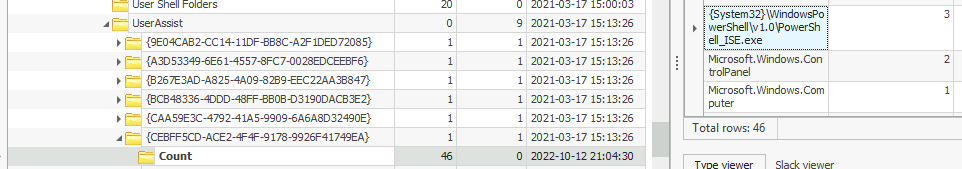

**Answer:** `3`

> **2.15 The suspect also executed a network monitoring tool. What is the name of the tool?**

Scrolling down the same page, I found the network monitoring tool used by the suspect.

**Answer:** `Wireshark`

> **2.16 Registry Hives also note the amount of time a process is in focus. Examine the Hives. For how many seconds was ProtonVPN executed?**

I found ProtonVPN's execution time in the UserAssist registry entry and converted it from minutes to seconds. This was also on the same page as Q2.14, I scrolled back up to search for it.

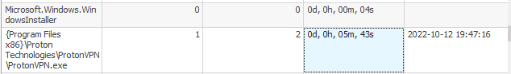

**Answer:** `343`

> **2.17 Everything.exe is a utility used to search for files on a Windows machine. What is the full path from which Everything.exe was executed?**

The path for `Everything.exe` was found in the same registry page as Q2.14

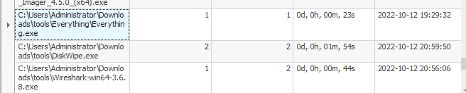

**Answer:** `C:\Users\Administrator\Downloads\tools\Everything\Everything.exe`

---

**Conclusion:** The forensic analysis confirmed that James copied the secret recipe from Jasmine’s laptop. Thank you for following along!
