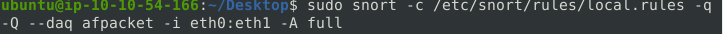

# Scenario 1 | Brute-Force

[+] THE NARRATOR


J&Y Enterprise is one of the top coffee retails in the world. They are known as tech-coffee shops and serve millions of coffee lover tech geeks and IT specialists every day. 


They are famous for specific coffee recipes for the IT community and unique names for these products. Their top five recipe names are;

WannaWhite, ZeroSleep, MacDown, BerryKeep and CryptoY.


J&Y's latest recipe, "Shot4J", attracted great attention at the global coffee festival. J&Y officials promised that the product will hit the stores in the coming months. 


The super-secret of this recipe is hidden in a digital safe. Attackers are after this recipe, and J&Y enterprises are having difficulties protecting their digital assets.


Last week, they received multiple attacks and decided to work with you to help them improve their security level and protect their recipe secrets.  


This is your assistant J.A.V.A. (Just Another Virtual Assistant). She is an AI-driven virtual assistant and will help you notice possible anomalies. Hey, wait, something is happening...


[+] J.A.V.A.

Welcome, sir. I am sorry for the interruption. It is an emergency. Somebody is knocking on the door!


[+] YOU

Knocking on the door? What do you mean by "knocking on the door"?


[+] J.A.V.A.

We have a brute-force attack, sir.


[+] THE NARRATOR

This is not a comic book! Would you mind going and checking what's going on! Please... 


[+] J.A.V.A.

Sir, you need to observe the traffic with Snort and identify the anomaly first. Then you can create a rule to stop the brute-force attack. GOOD LUCK!

## INSTRUCTIONS 

First of all, start Snort in sniffer mode and try to figure out the attack source, service and port.

Then, write an IPS rule and run Snort in IPS mode to stop the brute-force attack. Once you stop the attack properly, you will have the flag on the desktop!

Here are a few points to remember:

Create the rule and test it with "-A console" mode. 
Use "-A full" mode and the default log path to stop the attack.
Write the correct rule and run the Snort in IPS "-A full" mode.
Block the traffic at least for a minute and then the flag file will appear on your desktop.

>Question 1: Stop the attack and get the flag (which will appear on your Desktop)
>
First of all, I started the Virtual Machine then I compared my given IP adrress to the one running on the machine. 


I ran this command to know my network interface 
```shell
ifconfig
```

 

I confirmed eth0 is the network interface I am using. Then I executed Snort against eth0 in verbose mode. I added the `-X` to display the full packet details in HEX.  
Command:

```shell
sudo snort -i eth0 -v -X
```

I allowed the command to run for about 15-30 secs and stopped it. I decided to look through to see anything suspicious and I found a payload that was so suspicious and had so many instances of ssh


Also I found another packet with that seems like someone was trying to use SSH

 


I wanted to grep for SSH but I didn't log the file so I had to execute snort again and added `-l .` to the command. I changed my directory to desktop so as to easily access the log file, then I ran this command: 

```shell
sudo snort -i eth0 -v -X - l .
```
Then I executed another command to search for SSH using grep

 

Then I still found the suspicious packet and other packets with SSH


This packet was trying to bruteforce it's way to the system using port 22. It's from this IP address below and a random port trying to get into the target IP.

[Suspicious payload](assets/suspayload.png) 

So I decided to open a new terminal so as to create a rule to drop this connection. I went to `/etc/snort/rules/` Then I opened the file `local.rules` and wrote a rule to drop the packet. Remember, from the first snort room, there are several actions for a rule. We alert, log, drop, and reject. I made use of drop.

>drop: block and log the packet
>
I used nano to open the `local.rules` file

Command:
```shell
nano local.rules
```
Then I used this rule:
```shell
drop tcp any 22 <> any any (msg: "SSH attempt detected and dropped"; sid:1000001; rev:1;)
```
Save the file.

I went back to check on how IDS/IPS mode so I will know the command to run with snort. 

I used this command below to drop the packet:

```shell
sudo snort -c /ect/snort/rules/local.rules -q -Q --daq afpacket -i eth0:eth1 -A full
```



After running this command for about 1 min, I saw a green pop-up on my screen showing: "Congratulations, you have successfully stopped the attck". 

Then you will say the flag on the Desktop


ANSWER:

THM{81b7fef657f8aaa6e4e200d616738254}

>Question 2: What is the name of the service under attack?
>
>ANSWER: SSH
>
>Question 3: What is the used protocol/port in the attack?
>
>ANSWER: TCP/22
>

Successfully stopped a live brute force attack with Snort!! Unto the next Scenario


