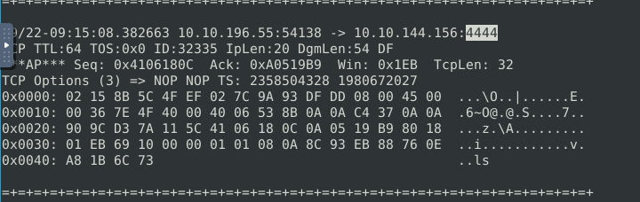
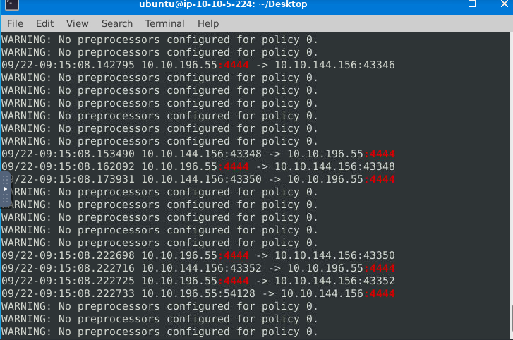
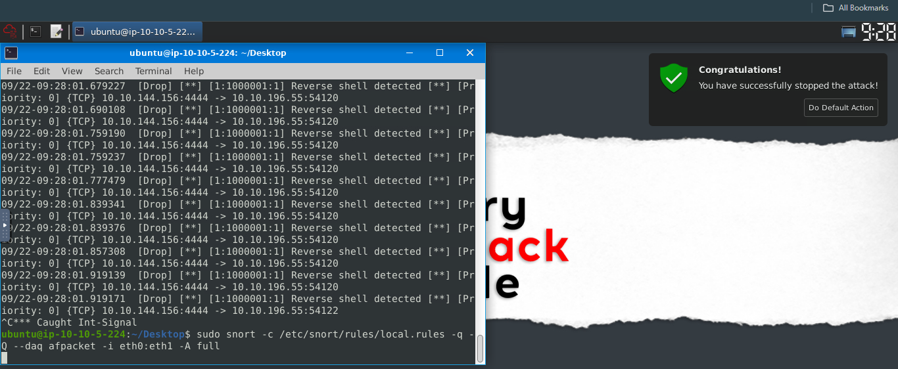
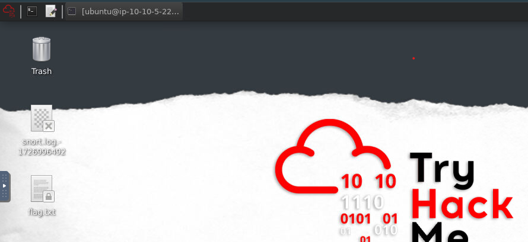

## Scenario 2 | Reverse-Shell

[+] THE NARRATOR


Good Job! Glad to have you in the team!


[+] J.A.V.A.

Congratulations sir. It is inspiring watching you work.


[+] You

Thanks team. J.A.V.A. can you do a quick scan for me? We haven't investigated the outbound traffic yet. 


[+] J.A.V.A.

Yes, sir. Outbound traffic investigation has begun. 


[+] THE NARRATOR

The outbound traffic? Why?


[+] YOU

We have stopped some inbound access attempts, so we didn't let the bad guys get in. How about the bad guys who are already inside? Also, no need to mention the insider risks, huh? The dwell time is still around 1-3 months, and I am quite new here, so it is worth checking the outgoing traffic as well.


[+] J.A.V.A.

Sir, persistent outbound traffic is detected. Possibly a reverse shell...


[+] YOU

You got it!


[+] J.A.V.A.

Sir, you need to observe the traffic with Snort and identify the anomaly first. Then you can create a rule to stop the reverse shell. GOOD LUCK!


## INSTRUCTIONS

First of all, start Snort in sniffer mode and try to figure out the attack source, service and port.

Then, write an IPS rule and run Snort in IPS mode to stop the brute-force attack. Once you stop the attack properly, you will have the flag on the desktop!

Here are a few points to remember:

Create the rule and test it with "-A console" mode. 
Use "-A full" mode and the default log path to stop the attack.
Write the correct rule and run the Snort in IPS "-A full" mode.
Block the traffic at least for a minute and then the flag file will appear on your desktop.


We are to stop another attack. Start your virtual machine and open the terminal.

I changed my current working directory to Desktop. We are going to run Snort in sniffer mode and log the packet capture.
```shell
sudo snort -v -l .
```
Allow it to run for some seconds before stopping it.

Then I read the log file
```shell
sudo snort -r snort.log.1726996492 -X 
```
I went through the file to see if anything suspicious then I saw a lot of port 4444, which is a suspicious port. 



I wanted to search further so I made use of grep to search for the port number
```shell
sudo snort -r snort.log.1726996492 -X | grep ":4444"
```
There were a lot of packets using this 4444.



I went to my `/etc/snort/rules` and opened the local.rules to write a rule to drop the packets.

```shell
drop tcp any 4444 <> any any (msg: "Reverse shell detected"; sid:1000001; rev:1;)
```
Save the rule and run snort command:

```shell
sudo snort -c /ect/snort/rules/local.rules -q -Q --daq afpacket -i eth0:eth1 -A full
```
Run it for at least one minute and that's it. Another live attack stopped!!



Note: 
I ran it with `-A console` initially so I can see the how the packets are being dropped that's why you can see that on my screen 😂
Also, the flag didn't drop when I used this because at the beginning we were told to use `-A full`.

The flag was already on the desktop after I ran it with correct command..



>Stop the attack and get the flag (which will appear on your Desktop)
>
>ANS: THM{0ead8c494861079b1b74ec2380d2cd24}
>
>What is the used protocol/port in the attack?
>
>ANS: TCP/4444
>
>Which tool is highly associated with this specific port number?
>
>ANS: Metasploit
>

🎉🎉🎉 

