# Snort Challenge - The Basics
Description: Put your snort skills into practice and write snort rules to analyse live capture network traffic.
Difficulty: Medium

## TASK 1 - INTRODUCTION

Nothing much, just launch your virtual machine to get started.

## TASK 2 - Writing IDS Rules (HTTP)

Open the terminal and navigate to the task 2 folder. The packet capture (`mx-3.pcap`) and our rule file (`local.rules`) will be there. 

**Question 1: Write a single rule to detect "all TCP port 80 traffic" packets in the given pcap file.**

We will open the local.rules to write the rule that will be used. I made use of nano, you can edit it with any text editor. Let's open it and enter the rule to use:

```shell
nano local.rules
```
The rule I used:

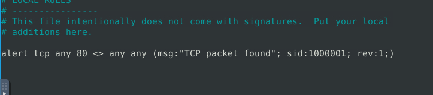 

Save, the rule and exit the text editor. Now we can apply the rule with the use of snort 

```shell
sudo snort -c local.rules -r mx-3.pcap -l .
```

Once the rule is applied, we will find our answer at the bottom of the output

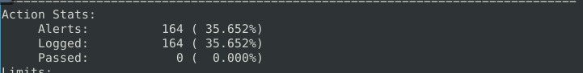

Answer: 164

**Question 2: What is the destination address of packet 63?**

From the snort code I executed in the first question, I made use -l which is used to log the output. To answer this question we can print the first 63 packets from the log (snort.log.171234....) I didn't remember to keep the logfile name. To print out, we can make use of: 

```shell
sudo snort -r snort.log.171234.... -A full -n 63
```
>Note: remember to put the accurate log file name 

The last packet is going to have the answer to the question

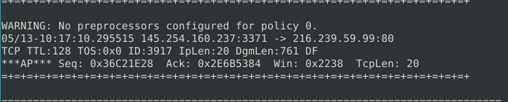

Answer: 216.239.59.99

**Question 3:  What is the ACK number of packet 64?**
We will repeat the last step but this time around for 64 packets 

```shell
sudo snort -r snort.log.171234.... -A full -n 64
```


Answer: 0x2E6B5384

**Question 4: What is the SEQ number of packet 62?**
From your previous output, scroll up and find the 62nd packet or you can run the same command again but change -n to 62

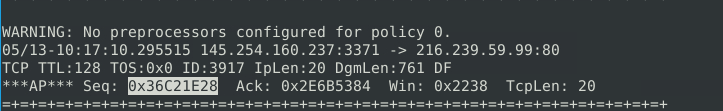 

Answer: 0x36C21E28

**The last three questions can be answered at once since they all relate to packet 65:** 

Let's run the command for packet 65:
```shell
sudo snort -r snort.log.171234... -A full -n 65
```
Output: 
.png) 

>What is the TTL of packet 65?
>
>Ans: 128
>
>What is the source IP of packet 65?
>
>Ans: 145.254.160.237
>
>What is the source port of packet 65?
>
>Ans: 3372

## TASK 3 - Writing IDS Rules (FTP)
Navigate to the task folder.
Use the given pcap file.

**Question 1: Write a single rule to detect "all TCP port 21"  traffic in the given pcap. What is the number of detected packets?**

The rule structure remains the same but with diffferent port number; 21. 

Rule used: 
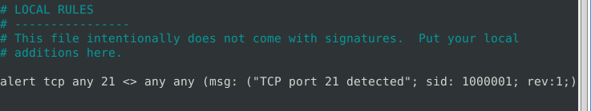 

We add the rule to `local.rules` and apply it to the `ftp-png-gif.pcap` packet capture. We can decide to log this or not but I did not. 
Command: 
```shell
sudo snort -c local.rules -r ftp-png-gif.pcap
```
Output: 

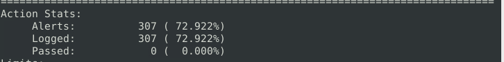

Answer: 307

**Question2: What is the FTP service name?**

If we try to read the packet (`ftp-png-gif.pcap`) directly, we won't understand because it is in binary format. So we will make use of strings which was taught in the snort room. This will help us extract the content in human readable format. 

Command:
```
strings - print the sequences of printable characters in files
```
We pipe the output from `strings` into `grep` to search for occurances of `ftp`:

```shell
strings ftp-png-gif.pcap | grep -i ftp
```
Output: 

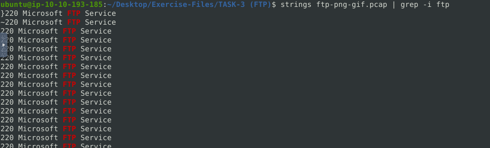 

Answer: Microsoft FTP Service

**Question 3: Deactivate/comment on the old rules. Write a rule to detect failed FTP login attempts in the given pcap. What is the number of detected packets?**

From the hint; Each failed FTP login attempt prompts a default message with the pattern; "530 User". Try to filter the given pattern in the inbound FTP traffic. We can use this hint to create a new rule: 

```shell
alert tcp any any <> any any (msg:"Failed FTP login attempt detected";content:"530 User";sid:1000001; rev :1;)
```
Save the rule and run it with Snort. Don't forget to delete or comment out the old rule.
Command: 
```shell
sudo snort -c local.rules  -r ftp-png-gif.pcap
```
Output:
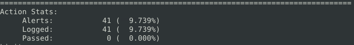 

Answer: 41

**Question 4: Deactivate/comment on the old rule. Write a rule to detect successful FTP logins in the given pcap. What is the number of detected packets?**

From the hint given, successful login attempt makes use of pattern: "230 user". So, we will edit the previous rule to make it match our new string. 

```shell
alert tcp any any <> any any (msg:"Successful FTP login detected";content:"230 User";sid:1000001; rev :1;)
```
Apply the rule with Snort then get the answer. Use the previous command above

Output: 
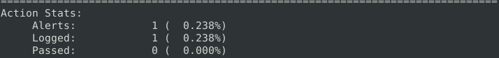

Answer: 1

**Question 4: Deactivate/comment on the old rule. Write a rule to detect FTP login attempts with a valid username but no password entered yet. What is the number of detected packets?**

Same process, edit the rule and apply the rule with Snort.

```shell
alert tcp any any <> any any (msg:"FTP login valid user, no password";content:"331 Password";sid:1000001; rev :1;)
```
Output:
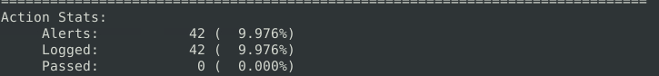 

Answer: 42

**Question 5: Deactivate/comment on the old rule. Write a rule to detect FTP login attempts with the "Administrator" username but no password entered yet. What is the number of detected packets?**

With snort, we can make use of the content option multiple times within a single rule. So we will add content:"Administrator" to the rule:

Rule: 
```shell
alert tcp any any <> any any (msg:"FTP -Administrator, no password";content:"331 Password";content:"Administrator";sid:1000001; rev :1;)
```
Output: 
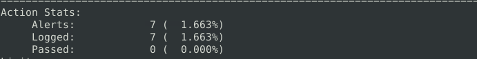 

Answer: 7

## TASK 4- Writing IDS Rules (PNG)

Navigate to the task folder.
Use the given pcap file.

**Question 1: Write a rule to detect the PNG file in the given pcap. Investigate the logs and identify the software name embedded in the packet.**

For this task, we are going to be making use of file signatures. This signature are known as Magic Numbers and that is what we will use to match packets that contains PNG. Refer to this link: [file signatures](https://en.wikipedia.org/wiki/List_of_file_signatures)

I made use of Ctrl+F to get the signature for PNG by searching for PNG. I copied it and we are going to use it for this rule.

Open your rule file (`local.rules`), comment or delete if there's any rule there. 

Rule to use:
```shell
alert tcp any any <> any any  (msg: "PNG file detected"; content:"|89 50 4E 47 0D 0A 1A 0A|"; sid:1000001; rev:1;)
```
`89 50 4E 47 0D 0A 1A 0A` is the signature and the pipe symbols instruct Snort to match hexadecimal bytes. 

Save the rule and apply with Snort
```shell
sudo snort -c local.rules -r ftp-png-gif.pcap -l .
```
Output: 
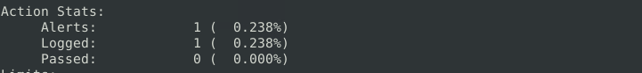 

That's not all, the main question is to identify the software name embedded in the packet. Since we created a log, we will extract it in human readable format with the use of strings;

```shell
sudo strings snort.log.1726932688
```
Output: 
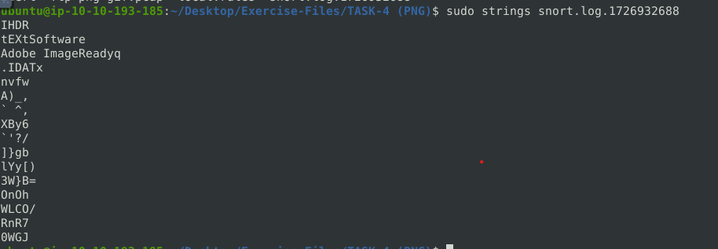 

Answer: Adobe ImageReady

**Question 2: Write a rule to detect the GIF file in the given pcap. Investigate the logs and identify the image format embedded in the packet.**

We will refer to the link and look for the magic number for GIF. I found out that there are two ASCII codes for GIF. There's "GIF89a" (47 49 46 38 39 61) or "GIF87a" (47 49 46 38 37 61)

So I wrote a rule for each of the ASCII codes and applied with SNORT but only one of them generated an answer. I will not tell us which of them worked but I will provide the rules. Goodluck!


```shell
alert tcp any any <> any any  (msg: "GIF89a file detected"; content:"|47 49 46 38 39 61|"; sid:1000001; rev:1;)
```

```shell
alert tcp any any <> any any  (msg: "GIF87a file detected"; content:"|47 49 46 38 37 61|"; sid:1000001; rev:1;)
```
One of them will give you the answer. Also when you get the alerts, make use of strings to generate the answer (sudo strings snort.log.123.....)

## TASK 5- Writing IDS Rules (Torrent Metafile)

Navigate to the task folder.

Use the given pcap file.

**Question 1: Write a rule to detect the torrent metafile in the given pcap. What is the number of detected packets?**

The rule I used:
```shell
alert tcp any any <> any any  (msg: ".torrent file detected"; content:".torrent"; sid:1000001; rev:1;)
```
Applied the rule with SNORT using the right pcap from the task. Make sure you log the filtered packet capture

Output: 
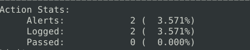 

Answer: 2

**Question2: Investigate the log/alarm files. What is the name of the torrent application?**
Command: 
```shell
sudo strings snort.log.1726933609
```
Output:
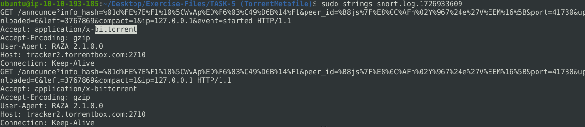 

Answer: bittorrent

**Question 3: Investigate the log/alarm files. What is the MIME (Multipurpose Internet Mail Extensions) type of the torrent metafile?**
The previous output contains the answer to this:

Answer:
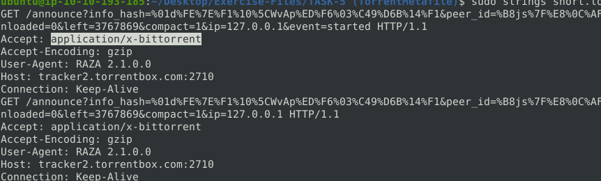 

**Question 4: Investigate the log/alarm files. What is the hostname of the torrent metafile?**
The answer is also in the previous output

Answer:
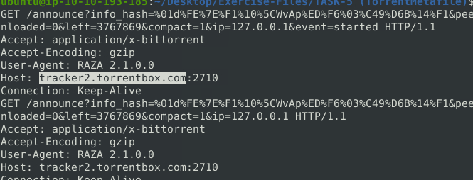 

## TASK 6- Troubleshooting Rule Syntax Errors

I am going to be brief as possible as from now on due to how long the task is, so I will only provide the correction to the rules. Pay close attention to the signs and spaces. Also you are to only save the correct rules and apply them. Only the correct rules should be in your `local.rules `.

```shell
# local-1.rules
# incorrect
alert tcp any 3372 -> any any(msg: "Troubleshooting 1"; sid:1000001; rev:1;)
# correct
alert tcp any 3372 -> any any (msg: "Troubleshooting 1"; sid:1000001; rev:1;)
```

```shell
# local-2.rules
# incorrect
alert icmp any -> any any (msg: "Troubleshooting 2"; sid:1000001; rev:1;)
# correct
alert icmp any any -> any any (msg: "Troubleshooting 2"; sid:1000001; rev:1;)
```

```shell
# local-3.rules
# incorrect
alert icmp any any -> any any (msg: "ICMP Packet Found"; sid:1000001; rev:1;)
alert tcp any any -> any 80,443 (msg: "HTTPX Packet Found"; sid:1000001; rev:1;)
# correct
alert icmp any any -> any any (msg: "ICMP Packet Found"; sid:1000001; rev:1;)
alert tcp any any -> any 80,443 (msg: "HTTPX Packet Found"; sid:1000002; rev:1;)
```

```shell
# local-4.rules
# incorrect
alert icmp any any -> any any (msg: "ICMP Packet Found"; sid:1000001; rev:1;)
alert tcp any 80,443 -> any any (msg: "HTTPX Packet Found": sid:1000001; rev:1;)
# correct
alert icmp any any -> any any (msg: "ICMP Packet Found"; sid:1000001; rev:1;)
alert tcp any 80,443 -> any any (msg: "HTTPX Packet Found"; sid:1000002; rev:1;)
```

```shell
# local-5.rules
# incorrect
alert icmp any any <> any any (msg: "ICMP Packet Found"; sid:1000001; rev:1;)
alert icmp any any <- any any (msg: "Inbound ICMP Packet Found"; sid;1000002; rev:1;)
alert tcp any any -> any 80,443 (msg: "HTTPX Packet Found": sid:1000003; rev:1;)
# correct
alert icmp any any <> any any (msg: "ICMP Packet Found"; sid:1000001; rev:1;)
alert icmp any any -> any any (msg: "Inbound ICMP Packet Found"; sid:1000002; rev:1;)
alert tcp any any -> any 80,443 (msg: "HTTPX Packet Found"; sid:1000003; rev:1;)
```

```shell
# local-6.rules
# incorrect
alert tcp any any <> any 80  (msg: "GET Request Found"; content:"|67 65 74|"; sid: 100001; rev:1;)
# correct
alert tcp any any <> any 80  (msg: "GET Request Found"; content:"|47 45 54|"; sid: 100001; rev:1;)
```
Note: for local-6.rules, I converted the HEX bytes to ASCII on Cyberchef and it shows that "67 65 74" represents lowercase "get"
Evidence: 
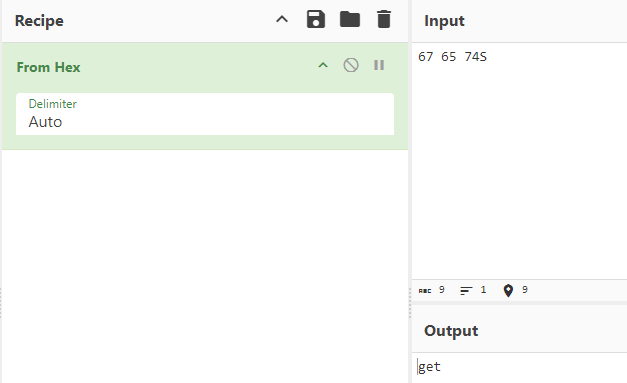

Then I converted the uppercase "GET" to HEX bytes
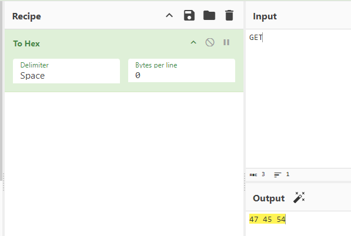 

```shell
# local-7.rules
# wrong
alert tcp any any <> any 80  (content:"|2E 68 74 6D 6C|"; sid: 100001; rev:1;)
# correct
alert tcp any any <> any 80  (msg: ".http file found"; content:"|2E 68 74 6D 6C|"; sid: 100001; rev:1;)
```

## TASK 7- Using External Rules (MS17-010)

Navigate to the task folder.
Use the given pcap file.

**Question 1: Use the given rule file (local.rules) to investigate the ms1710 exploitation. What is the number of detected packets?**

Use this command:

```shell
sudo snort -c local.rules -r ms-17-010.pcap
```

Output:
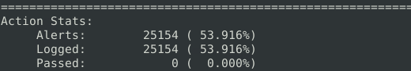 

Read answer from the output

**Question 2: Use local-1.rules empty file to write a new rule to detect payloads containing the "\IPC$" keyword. What is the number of detected packets?**

I wrote this rule initially and got this error 
Rule: 
```shell
alert tcp any any <> any any (msg: "IPC keyword found"; content: "\IPC$"; sid:1000001; rev:1;)
```
Error:
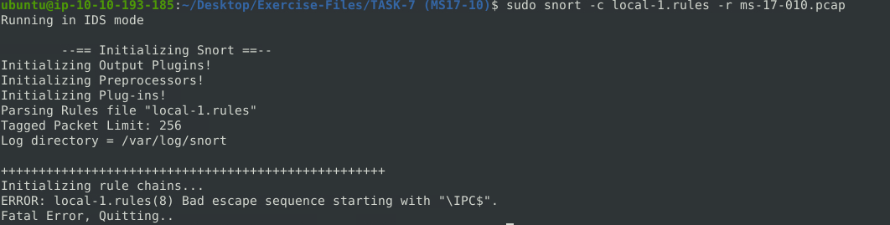 

I searched for the error and I learnt that `\` must be escaped with `\`. So the right rule would be: 

```shell
alert tcp any any <> any any  (msg: "IPC keyword found"; content:"\\IPC$"; sid: 1000001; rev:1;)
```
Output:

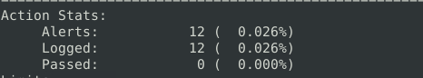

**Question 3: Investigate the log/alarm files. What is the requested path?**

Log the filtered packet capture: 

```shell
sudo snort -r ms-17-010.pcap -c local-1.rules -l .
```

and look at its strings

```shell
sudo strings snort.log.1717898210
```
Output: 

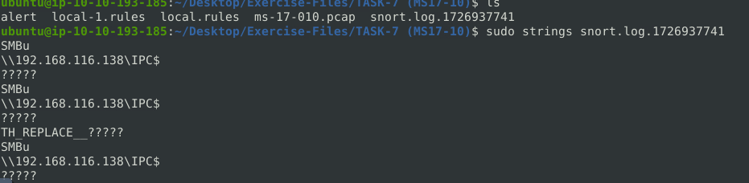 

**Question 4: What is the CVSS v2 score of the MS17-010 vulnerability?**

You can easily search for this on Google 

Answer: 9.3

## TASK 8 -Using External Rules (Log4j) 

Navigate to the task folder. Use the given pcap file. 

**Question 1: Use the given rule file (local.rules) to investigate the log4j exploitation. What is the number of detected packets?**

Execute Snort

```shell
sudo snort -c local.rules -r log4j.pcap -l .
```
Output:

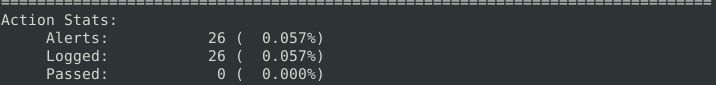

Answer: 26

**Question 2: Investigate the log/alarm files. How many rules were triggered?.**

When you sroll up in the previous output, you will see Events and that will give you the answer

Output:

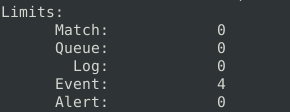

**Question 3: Investigate the log/alarm files. What are the first six digits of the triggered rule sids?** 

The rules and their IDs are listed at the end of the output

Answer:

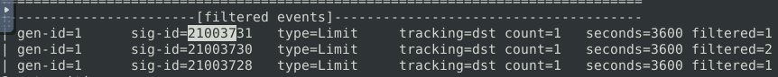

**Question 4: Clear the previous log and alarm files. Use local-1.rules empty file to write a new rule to detect packet payloads between 770 and 855 bytes. What is the number of detected packets?**

Write a rule in `local-1.rules`. The rule is:

```shell
alert tcp any any <> any any  (msg: "payloads between 770 and 855 bytes"; dsize: 770<>855; sid: 1000001; rev:1;)
```
Run

```shell
sudo snort -c local-1.rules -r log4j.pcap -l .
```
Output:

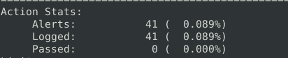

**Question 5: Investigate the log/alarm files. What is the name of the used encoding algorithm?**

We will run snort command and execute with `-A cmg` option to include payload data in the console output:

```shell
sudo snort -r snort.log.1717900099 -A cmg
```
The answer is in the second to last packet

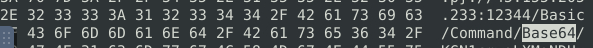

**Question 6: Investigate the log/alarm files. What is the IP ID of the corresponding packet?** 

It's in the header of the same packet 

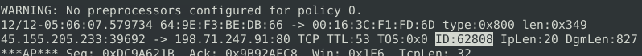

**Question 7: Investigate the log/alarm files. Decode the encoded command. What is the attacker's command?** 

It's in the payload of the same packet. I copied it and made use of Cyberchef to get the answer

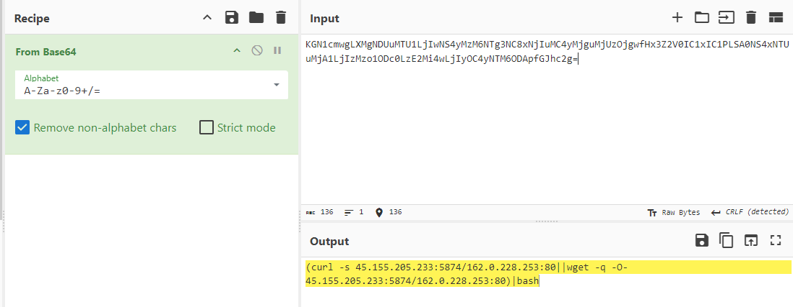

**Question 8: What is the CVSS v2 score of the Log4j vulnerability?**

Make use of Google to get the answer

Peace ✌ 
